# 微网与外部电网电力调控策略的建模与优化

> 2026 年高教社杯全国大学生数学建模竞赛 C 题「微网与外部电网电力调控策略」
>
> **数值来源声明**：本文全部数值均引自各子题冻结文件（`results/Q1~Q4/reports/frozen_numbers.json`），其中问题二、问题三、问题四分别采用 round4 逐日滚动/round4 块级/round3 块级口径（`q=80` 冻结主值）；严禁引用冻结文件之外的数值；各问答案表（表 1/表 2/表 3）的逐区间数值引自同次冻结运行输出的 `result1~4.xlsx`（提交件），稳健性/敏感性分析的次级数值引自各题冻结稳健性报告（`robustness/*`），均属冻结产出、未手工生成。符号严格复用 `planning/symbol_table.md` 统一符号表，全文符号一致、前后不矛盾。图为 `paper/figures/` 下已渲染校验（300 dpi PNG + SVG）。

---

## 摘要

非孤岛式微网由分布式光伏、储能设备与小区负载构成，并与外部电网存在电能交易。如何协调购电与储能充放电、在保证供电可靠的前提下降低购电支出，是微网经济运行的核心问题。本文围绕"确定条件—动态预测—波动电价"三条主线，依次建立四问模型。

**针对问题一**（确定条件下单日调度），以代表日 144 个 10 分钟区间为粒度，建立以全天购电费最小为目标的**线性规划（LP）**模型，用 HiGHS 求解得全天购电费 **35 126.95 元**，较"无储能"基准（48 052.05 元）下降 **26.90%**，较"规则峰谷套利"基准（46 143.08 元）再降 11 016.13 元，储能呈清晰的"谷充峰放"行为。

**针对问题二**（全年逐日滚动调度），在仅用附件 2 历史数据、无日前外部预报的信息约束下，提出"**净负荷 7 天加权自预报 + 按星期分桶 80 分位风险修正 + 逐日滚动 LP**"框架，将报童临界比 $q^\star=(\alpha_{em}-1)/\alpha_{em}=0.8$ 作为理论锚定的风险分位。报告期总购电费 **14 559 104.58 元**，较无储能基准（18 172 127.42 元）降 **19.88%**；紧急购电仅占报告期电量的 2.08%，风险修正机制有效。

**针对问题三**（滚动光伏预报下的计划—调整调度），建立"**0:00 计划 + 6/12/18 三次调整的滚动时域 MPC**"模型，以分段计费（违约 $\beta_{pen}=0.5$、溢价 $\gamma_{pre}=1.5$）刻画计划偏离成本，并引入"发布时刻 × 执行 6 h 块"的**区间级光伏风险修正**。报告期总购电费 **14 049 999.28 元**，较"仅 0:00 计划"降 3 241 137.30 元；通过边际价值分析论证**无需引入更多预报时刻**。

**针对问题四**（波动电价），将问题二、问题三模型中的恒定电价 $p_t$ 替换为附件 4 波动电价 $p_{d,t}$ 重解，得 result4-2 **15 231 785.59 元**、result4-3 **14 694 112.99 元**。波动电价与负荷正相关（$\mathrm{corr}(p,L)=+0.508$），在放大储能套利空间（+1.97%）的同时抬升基础用电成本并放大预报误差损失，净效应使总成本较恒定电价 **+4.62%**。

全文模型均保证信息集严格合规（无前视泄漏）、数值可复现、结论可溯源；稳健性与敏感性分析（风险分位扫描、预报窗口/效率口径扰动、负荷光伏 ±5% 扰动、电价波动幅度与电价预测不确定性、极端低价退化检验等）总体支撑上述结论。

**关键词**：微网；线性规划；储能调度；报童模型；滚动时域模型预测控制（MPC）；波动电价；风险修正

---

## 一、问题重述

### 1.1 问题背景

随着新能源技术快速发展，以光伏发电为代表的分布式能源在居民小区等场景中应用日益广泛。微网作为连接分布式能源、储能设备与外部电网的小型供用电系统，可协调不同能源之间的能量流动，提高新能源消纳能力并降低运行成本。然而光伏发电具有间歇性与波动性，其出力易受天气与时段影响，导致发电量与负载需求之间不匹配；同时外部电网电价存在时段差异甚至逐日波动，使购电策略的制定面临经济性与可靠性的双重挑战。因此，如何结合小区负载、光伏（预测）信息与储能状态，合理制定购电与充放电策略，在保证供电的同时降低购电费用，是微网优化运行的关键问题。

### 1.2 问题提出

设调度周期为一天，以 10 分钟为一个区间（每日 $T=144$ 个区间，$\Delta t=1/6$ h）。储能设备参数由附录 1 给定：额定容量 12 000 kWh，运行储电量区间 $[1200,10800]$ kWh，最大充/放电功率 5 000 kW，充放电效率 $\eta_c=\eta_d=0.9$，初始储电量 $E_0=6000$ kWh。需建立数学模型解决以下四问：

**问题一**：每天电价、小区负载保持不变，给定一天光伏发电功率预测数据，建立微网当天计划购电策略模型，求解完整购电策略并保存到 `result1.xlsx`，填写表 1、表 2。

**问题二**：每天电价保持不变，小区负载和光伏发电功率随时间变化，根据全年负载与光伏实际数据建立当天计划购电策略模型，求解 2025 年每天完整购电策略，供电不足时紧急购电（紧急电价为交易时刻电价的 $\alpha_{em}=5$ 倍），保存到 `result2.xlsx`，填写表 1、表 2、表 3。

**问题三**：每天可于 0:00、6:00、12:00、18:00 获得未来 24 小时光伏发电功率预测，建立考虑预测更新的购电调整策略模型；计划购电量高于调整部分按电价 $\beta_{pen}=0.5$ 计违约费、调整高于计划部分按 $\gamma_{pre}=1.5$ 倍计溢价，保存到 `result3.xlsx`，填写表 1、表 2、表 3，并分析是否需要引入其他时刻的预测。

**问题四**：外部电网电价实时波动（附件 4），重新求解问题二与问题三，保存到 `result4-2.xlsx`、`result4-3.xlsx`，给出相应计算结果。

---

## 二、问题分析

### 2.1 整体分析

四问共享同一微网物理结构（光伏 + 储能 + 负载 + 外网购电）与同一能量平衡内核，区别在于**信息集**与**电价结构**逐步复杂化：

- **问题一**为确定性、单日、单目标连续优化：负载、光伏预测、电价均已知且确定，可直接建模为 LP。
- **问题二**引入逐日变化与**信息约束**：0:00 无法获得日前外部预报，只能由附件 2 历史负载/光伏自预报当日净负荷，预报误差须由 5 倍紧急购电吸收，形成典型的**报童（newsvendor）结构**。
- **问题三**引入**滚动预报**：0/6/12/18 四个时刻可获得更新后的光伏预报，购电须在"计划—调整"间权衡，且调整计费非线性（分段），须线性化处理。
- **问题四**将电价由恒定日曲线改为逐日波动，模型结构不变但费用函数中的 $p_t\to p_{d,t}$，波动电价与负荷正相关带来新的经济效应。

### 2.2 各问建模要点

1. **问题一**：以 $\min \sum_t p_t x_t$ 为目标，能量平衡、储能动态、容量/功率边界、日闭合为约束的静态 LP。
2. **问题二**：净负荷自预报 + 按星期分桶风险修正 + 逐日滚动 LP，报童临界比确定风险分位 $q=80$。
3. **问题三**：滚动时域 MPC + 分段计费线性化 + 区间级光伏风险修正，日闭合保证跨日可重复。
4. **问题四**：继承问题二/问题三模型，仅替换电价为 $p_{d,t}$，量化波动电价的经济效应。

---

## 三、模型假设

在建模前，作如下必要与简化假设（符号统一见第四节）。

**必要假设**：

| 编号 | 假设内容 | 说明 |
|---|---|---|
| A1 | 一天离散为 $T=144$ 个等长 10 分钟区间，区间内功率恒定，区间电量 $=$ 功率 $\times \Delta t$ | 题目按 10 分钟输出，离散化是有限维优化的前提 |
| A2 | 微网供电（购电 + 光伏 + 放电）必须不低于小区负载 | 题目硬约束 |
| A3 | 储能量 $\in[1200,10800]$ kWh，充/放电功率 $\le 5000$ kW，初始 $E_0=6000$ kWh | 附录 1 给定 |
| A4 | 充放电效率为单向 0.9：充电使储能增 $\eta_c c$，放电使储能减 $q/\eta_d$ | 效率方向口径，敏感性见 §9 |
| A5 | 计划购电按计划量结算；计划/调整偏差按 $\beta_{pen}/\gamma_{pre}$ 计费；供电缺口按 $\alpha_{em}=5$ 倍紧急价补齐 | 题目计费规则 |
| A6 | 能量平衡口径 $x+z+G\Delta t+q\ge L\Delta t+c$ | 区间级能量守恒（符号表核心关系式） |

**简化假设**：

| 编号 | 假设内容 | 说明 |
|---|---|---|
| S1 | 问题一用"代表日"：附件 1 负载 = 附件 2 全年各时点均值、电价 = 附件 4 全年均值 | 数据审计结论 |
| S2 | 计划购电量无上限（外网购电能力充足） | 题目未给购电上限 |
| S3 | 储能同区间不边充边放（$c_t q_t=0$） | 效率 $<1$ 时由最优性自然满足 |
| S4 | 光伏可本地全额消纳（直供负载或充储能） | 弃光不省钱时默认全额消纳 |
| S5 | 忽略储能自放电、线路损耗与维护成本 | 题目未提及，对经济性影响次要 |
| S6 | 问题四电价 $p_{d,t}$ 视为日前已知（主模型假设，其代价由 §9.4 量化，<1%） | 电价预测不确定性检验见 §9 |

---

## 四、符号说明

本文符号严格复用 `planning/symbol_table.md`，关键符号如下：

| 符号 | 含义 | 单位 |
|---|---|---|
| $t$ | 日内区间序号，$t=1,\dots,T$，$T=144$ | — |
| $d$ | 日期序号，$d=1,\dots,D$，$D=334$（报告期 2025-02-01~12-31；2025-01 为自预报预热期） | — |
| $\Delta t$ | 区间时长，$\Delta t=1/6$ h | h |
| $s$ | 光伏预报发布时刻，$s\in\{0,6,12,18\}$ | 时 |
| $p_t$ | 恒定日电价（附件 1，Q1–Q3） | 元/kWh |
| $p_{d,t}$ | 波动电价（附件 4，第 $d$ 天区间 $t$，Q4） | 元/kWh |
| $L_t,\ L_{d,t}$ | Q1 单日负载 / 第 $d$ 天区间 $t$ 实际负载 | kW |
| $G_{d,t}$ | 第 $d$ 天区间 $t$ 光伏实际功率（附件 2） | kW |
| $\hat G_t$ | Q1 单日光伏预测功率 | kW |
| $\hat G_{d,s,h}$ | 附件 3 光伏预报（$s$ 时刻发布、提前 $h$ 小时） | kW |
| $\hat G_{d,s,t}$ | 区间级光伏预报（整点预报阶梯映射到 10 min 区间） | kW |
| $\hat G^{\mathrm{safe}}_{d,s,t}$ | 风险修正后安全光伏预报 $=\operatorname{clip}_0(\hat G_{d,s,t}-\delta_{d,s,t})$ | kW |
| $\delta_{d,s,t}$ | 区间级光伏风险修正量 $=P_{80}(\hat G_{d,s,t}-G_{d,t})$ | kW |
| $N_{d,t}$ | 净负荷 $=L_{d,t}-G_{d,t}$ | kW |
| $\hat N_{d,t}$ | 净负荷自预报（前 7 天加权平均） | kW |
| $e^{q}_{d,t}$ | 净负荷历史误差 $q$ 分位风险修正（$q=80$） | kW |
| $x_{d,t}$ | 计划购电量（0:00 制定） | kWh |
| $y_{d,t}$ | 调整购电量（Q3/Q4 滚动调整后执行） | kWh |
| $z_{d,t}$ | 紧急购电量（供电不足补齐） | kWh |
| $c_{d,t},\ q_{d,t}$ | 充电电量 / 放电电量 | kWh |
| $E_{d,t}$ | 区间 $t$ 末储电量 | kWh |
| $E_{\min},E_{\max},E_0$ | 储电量下/上限 $=1200/10800$、初始储电量 $=6000$ | kWh |
| $P^c_{\max}=P^d_{\max}$ | 最大充/放电功率 $=5000$ | kW |
| $\eta_c,\eta_d$ | 充/放电效率 $=0.9$ | — |
| $\alpha_{em},\beta_{pen},\gamma_{pre}$ | 紧急/违约/溢价系数 $=5/0.5/1.5$ | — |
| $C_1,C_2,C_3,C_4$ | 各问报告期总购电费 | 元 |

**核心关系式（全文统一）**：

能量平衡（供电 ≥ 负载）：

$$
x_{d,t}+z_{d,t}+G_{d,t}\Delta t+q_{d,t}\ \ge\ L_{d,t}\Delta t+c_{d,t} .
$$

储能动态（区间 $t$ 末储电量）：

$$
E_{d,t}=E_{d,t-1}+\eta_c\,c_{d,t}-\frac{q_{d,t}}{\eta_d},\qquad
E_{\min}\le E_{d,t}\le E_{\max},\quad 0\le c_{d,t}\le P^c_{\max}\Delta t,\quad 0\le q_{d,t}\le P^d_{\max}\Delta t .
$$

（Q1 无 $z$、用 $\hat G_t$ 代 $G_{d,t}$、$L_t$ 代 $L_{d,t}$；Q3/Q4 中 $x$ 为最终执行购电 $y$。）

---

## 五、问题一：确定条件下的单日最优购电调度模型

### 5.1 模型建立

问题一是确定性、单目标、连续变量的静态优化问题：目标与约束均为线性，故可精确建模为 LP 并获全局最优解。

**决策变量**：区间计划购电量 $x_t\ge0$、充电量 $c_t\ge0$、放电量 $q_t\ge0$；状态变量为区间末储电量 $E_t$（$E_0$ 给定）。变量总数 $3T+(T+1)=577$。

**目标函数**（最小化全天购电费）：

$$
\min \quad C_1=\sum_{t=1}^{T}p_t\,x_t . \tag{1}
$$

**约束条件**：

（a）能量平衡：$x_t+\hat G_t\Delta t+q_t\ge L_t\Delta t+c_t$；

（b）储能动态：$E_t=E_{t-1}+\eta_c c_t-\frac{q_t}{\eta_d}$；

（c）充放电功率与容量边界：$0\le c_t\le P^c_{\max}\Delta t$，$0\le q_t\le P^d_{\max}\Delta t$，$E_{\min}\le E_t\le E_{\max}$；

（d）终态闭合：$E_0=E_T=6000$ kWh。

该 LP 含 577 变量、578 个线性约束，用 scipy `linprog`（HiGHS）求解约 0.014 s。因 $\eta_c=\eta_d=0.9<1$，同区间边充边放恒非最优，最优解自动满足 $c_t q_t=0$（数值核验为 0 个冲突区间）。

### 5.2 求解结果

| 指标 | 数值 |
|---|---|
| 全天购电费 $C_1$ | **35 126.95 元** |
| 总购电量 $\sum_t x_t$ | 59 482.70 kWh |
| 储能累计充电 / 放电 | 20 740.67 / 16 799.94 kWh |
| 0:00 与 24:00 储电量 | $E_0=E_T=6000$ kWh |

**表 5.1　微网在指定时间段的购电量及全天购电量、购电费**

| 时间段 | 购电量(kWh) | 时间段 | 购电量(kWh) | 时间段 | 购电量(kWh) |
|---|---|---|---|---|---|
| 10:00–10:10 | 0.00 | 12:00–12:10 | 486.40 | 14:00–14:10 | 0.00 |
| 16:00–16:10 | 394.93 | 18:00–18:10 | 636.98 | 20:00–20:10 | 0.00 |
| 全天购电量 | 59 482.70 | — | — | 全天购电费 | 35 126.95 元 |

**表 5.2　储能设备指定时间段充放电量及 0:00 / 24:00 储电量**

| 时间段 | 充电量 | 放电量 | 时间段 | 充电量 | 放电量 |
|---|---|---|---|---|---|
| 0:00–4:00 | 4500.00 | 0.00 | 4:00–8:00 | 833.33 | 6365.84 |
| 8:00–12:00 | 4787.96 | 1703.00 | 12:00–16:00 | 5286.04 | 91.10 |
| 16:00–20:00 | 0.00 | 5780.13 | 20:00–24:00 | 5333.33 | 2859.87 |
| 0:00 储电量 | 6000 | — | 24:00 储电量 | 6000 | — |

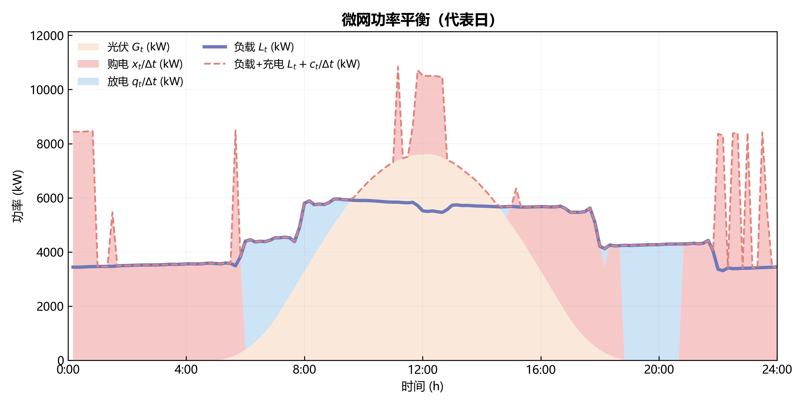

![图 5.2　储能储电量 $E_t$ 变化曲线（全程落在 $[1200,10800]$ kWh 内，$E(0)=E(24)=6000$）](figures/fig_q1_2_soc.png)


储能量轨迹 $6000\to10800$（5:40 充满）$\to1974$（10:00）$\to10800$（14:30–18:00）$\to1200$（20:40 放空）$\to6000$（24:00），完成"夜间谷充 → 早高峰放 → 午间光伏再充 → 晚高峰放空 → 夜间回充"的完整循环。低价时段完成 85.67% 的充电量、高价时段完成 84.90% 的放电量，呈清晰的谷充峰放行为。

### 5.3 与基准方案对比

| 方案 | 全天购电费（元） | 较主模型节省（元） |
|---|---|---|
| 主模型 M1（LP） | 35 126.95 | — |
| 基准 B1（无储能） | 48 052.05 | 12 925.10 |
| 基准 R1（规则峰谷套利） | 46 143.08 | 11 016.13 |

**储能价值** $=B_1-C_1=12 925.10$ 元（占比 **26.90%**）；**优化价值** $=R_1-C_1=11 016.13$ 元，即 LP 相对启发式规则的增益。约束满足性核验：能量平衡残差最大 $2.27\times10^{-13}$ kWh、储能/功率越界 0 次、终态闭合成立。

---

## 六、问题二：全年逐日滚动购电策略模型

### 6.1 模型建立

#### 6.1.1 建模思路与候选方案迭代

问题二的建模难点在于：微网每天 0:00 决策时无法获得任何日前光伏预报，只能借助附件 2 历史负载与光伏自行估计当日净负荷，而估计误差又会经 5 倍紧急购电价非线性放大。本节记录由朴素候选方案逐步试错、最终收敛到 6.1.2 节模型的完整思路演进。

**阶段①　7 天滑动平均 + 确定性线性规划。** 最直观的做法是取近 7 天同期净负荷的简单平均作为当日净负荷点估计 $\hat N_{d,t}$，再据此求解单日确定性 LP。其致命缺陷在于**完全未刻画预报误差的分布**：点估计隐含地假设"实际净负荷恰等于历史平均"，一旦实际净负荷系统性高于点估计（例如连续阴雨使光伏持续偏弱），计划购电不足的缺口只能由 5 倍紧急购电补齐。图 6.3 左端（分位 $q\to 0$，即零裕量甚至负裕量）的总费用高达 25 093 998.32 元且以紧急购电费为主导，直观印证了"低估净负荷触发 5 倍紧急购电"的尾部风险若不显式建模，费用将剧烈恶化。

**阶段②　全局分位风险裕量。** 为吸收预报误差，一个自然改进是给点估计叠加历史误差的全局 $q$ 分位作为安全裕量 $N^{\mathrm{safe}}_{d,t}=\hat N_{d,t}+e^{q}_{d,t}$，即对所有历史误差一视同仁地取分位。然而图 6.1 显示日净负荷的滞后 7 天自相关系数约 0.945，远大于滞后 1 天的约 0.467，表明净负荷存在**强星期周期**；全局分桶将工作日与周末、不同星期几的误差混为一谈，导致周日被系统性低估、周五被系统性高估，紧急购电呈现明显的星期性尖峰（图 6.2）。这种"一刀切"的全局裕量无法适配逐星期异质的误差分布。

**阶段③　按星期分桶的风险修正与报童临界比。** 针对星期异质性，将历史误差按星期几分桶，仅用第 $d$ 天之前同星期几的误差求 $q$ 分位，即 $e^{q,\mathrm{dow}}_{d,t}=Q_q\big(\{e_{d',t}:d'<d,\ \mathrm{dow}(d')=\mathrm{dow}(d)\}\big)$。此时最优分位 $q^\star$ 可由报童模型解析给出：少购一单位净负荷的边际代价为 $c_u=(\alpha_{em}-1)p_t$，多购一单位净负荷的边际浪费为 $c_o=p_t$，故使期望代价最小的覆盖概率为

$$
q^\star=\frac{c_u}{c_u+c_o}=\frac{(\alpha_{em}-1)p_t}{(\alpha_{em}-1)p_t+p_t}=\frac{\alpha_{em}-1}{\alpha_{em}}=\frac{4}{5}=0.8 .
$$

其**业务含义**在于：紧急购电的边际代价是正常购电的 $(\alpha_{em}-1)=4$ 倍，因此最优策略不应追求以 100% 的概率覆盖实际净负荷（那将造成大量多购浪费），而只需令计划购电以 80% 的概率覆盖实际净负荷，即可在"少购被 5 倍罚"与"多购被浪费"之间取得期望平衡。这一解析结论与经验一致：图 6.3 中 $q=80$ 处总费用为 14 559 104.58 元，较样本内经验最优 $q=90$（14 461 289.17 元）仅高 0.67%，且目标函数在 70–95 平坦，说明报童临界比 0.8 既具理论最优性、又对分位扰动稳健。

**阶段④　最终方案。** 综合前三阶段，确定最终框架为"**7 天加权自预报 + 按星期分桶 80 分位风险修正 + 逐日滚动 LP**"：预报采用按时间衰减的加权核 $w=[0.3,0.2,0.15,0.12,0.1,0.08,0.05]$，以匹配净负荷的时间相关性（R2 窗口稳健性检验中，7 天加权较 7 天均匀核的 14 660 223.93 元再降约 0.69%）。最终报告期总购电费 14 559 104.58 元，紧急购电仅占电量 2.08%、弃光率 13.40%，兼顾经济性与尾部风险。

**阶段⑤　全局一次性联合优化与动态规划对照。** 我们还考察了将全年一次性联合求解的全局优化（LP/MILP）或动态规划（DP）作为主模型的可能性。一方面，以储能荷电状态为状态、全年 $144\times 365$ 个时段为时间步的 DP 遭遇"**维数灾难**"，状态—动作空间随天数指数增长，难以在竞赛时限内精确求解；另一方面，全局一次性联合求解意味着决策时可获知未来全部真实净负荷，**违反时间因果律**。在最小化问题中，这种完美预见解只能作为**事后理论下界**，用于诊断跨日耦合强度的上限，而**无法在线执行**。故该思路仅留作事后参照，不纳入主模型。

**阶段⑥　简单规则策略对照。** 我们还以"价格阈值贪心充放 + 缺口购电"的规则策略（R2）作为对照：它无需优化求解、直观可解释，但缺乏理论最优性保证，且其阈值设定无法定量权衡"5 倍紧急购电风险"与"计划购电成本"之间的代价。实测 R2 总费用 16 572 068.47 元，比主模型高 2 012 963.89 元（即优化价值），印证规则策略难以逼近最优。

经上述六阶段试错，最终以阶段④的框架作为问题二主模型，其严格数学形式见 6.1.2 节。

#### 6.1.2 数学模型

问题二的关键约束在于**信息集**：附件 3（0/6/12/18 光伏预报）属问题三、四，问题二在 0:00 无法获得日前预报，只能由附件 2 历史负载/光伏自行预报当日净负荷。预报误差由 5 倍紧急购电价吸收，形成"少购多付罚、多购多浪费"的报童结构。

**（1）净负荷自预报**。定义净负荷 $N_{d,t}=L_{d,t}-G_{d,t}$，用前 7 天同期净负荷加权平均自预报（时间因果）：

$$
\hat N_{d,t}=\sum_{k=1}^{7}w_k N_{d-k,t},\qquad w=[0.3,0.2,0.15,0.12,0.1,0.08,0.05] .
$$

**（2）按星期分桶的风险修正（报童模型）**。预报误差 $e_{d,t}=N_{d,t}-\hat N_{d,t}$ 存在强星期周期（日净负荷滞后 7 天自相关远大于滞后 1 天，图 6.1），故按星期分桶、仅用 $d$ 之前同星期几的历史误差求 $q$ 分位，构造安全净负荷：

$$
e^{q,\mathrm{dow}}_{d,t}=Q_q\big(\{e_{d',t}:d'<d,\ \mathrm{dow}(d')=\mathrm{dow}(d)\}\big),\qquad N^{\mathrm{safe}}_{d,t}=\hat N_{d,t}+e^{q,\mathrm{dow}}_{d,t} .
$$

分位 $q$ 由**报童临界比**解析确定：少购一单位额外代价 $(\alpha_{em}-1)p_t$，多购一单位浪费 $p_t$，故

$$
q^\star=\frac{c_u}{c_u+c_o}=\frac{(\alpha_{em}-1)p_t}{(\alpha_{em}-1)p_t+p_t}=\frac{\alpha_{em}-1}{\alpha_{em}}=\frac{4}{5}=0.8 .
$$

故取 $q=80$（实测按星期分桶后经验 argmin $q=90$、$q=80$ 仅高 0.67%，目标在 70–95 平坦）。

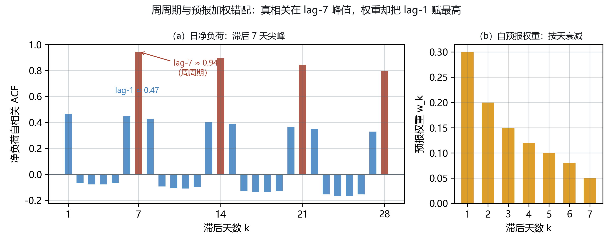

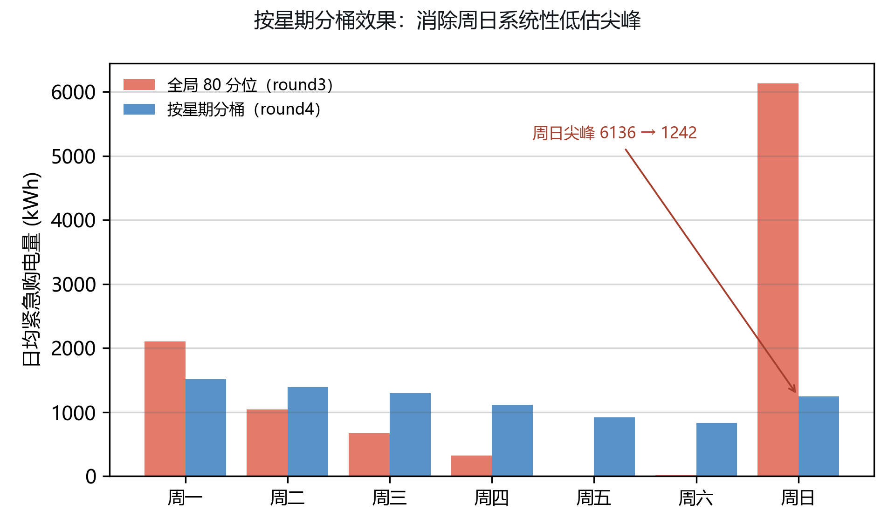

**（3）逐日滚动 LP**。每天 0:00 对当日解一个 LP（目标 $\min\sum_t p_t x_t$），约束为能量平衡 $x_t+q_t\ge N^{\mathrm{safe}}_{d,t}\Delta t+c_t$、储能动态与边界、日末循环 $E_T=E_0$。

**（4）实际结算与紧急购电**。以真实净负荷结算，缺口由紧急购电补齐 $z_{d,t}=\max(N_{d,t}\Delta t+c_{d,t}-x_{d,t}-q_{d,t},0)$，报告期总购电费

$$
C_2=\sum_{d,t}p_t\big(x_{d,t}+\alpha_{em}z_{d,t}\big),\qquad \alpha_{em}=5 .
$$

### 6.2 求解结果

报告期（2025-02-01~12-31，共 334 天；2025-01 为净负荷自预报所需的 7 天滚动预热期，不纳入结算）逐日滚动求解 334 次确定性 LP（HiGHS，种子 SEED=2026），结果如下：

**表 6.1　问题二主模型关键指标**

| 指标 | 数值 |
|---|---|
| 报告期总购电费 $C_2$ | **14 559 104.58 元** |
| 其中：计划购电费 / 紧急购电费 | 13 008 179.66 / 1 550 924.93 元 |
| 紧急购电量（占报告期电量 2.08%） | 396 939.32 kWh |
| 紧急购电区间数 | 11 977 个 |
| 弃光率 | 13.40% |

紧急购电仅占 2.08% 的电量，说明 80 分位按星期分桶的风险修正已把"少购被罚"的尾部风险控制在较低水平。

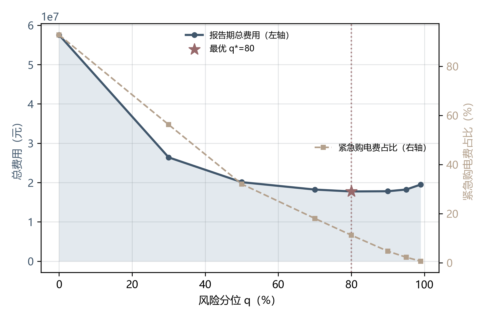

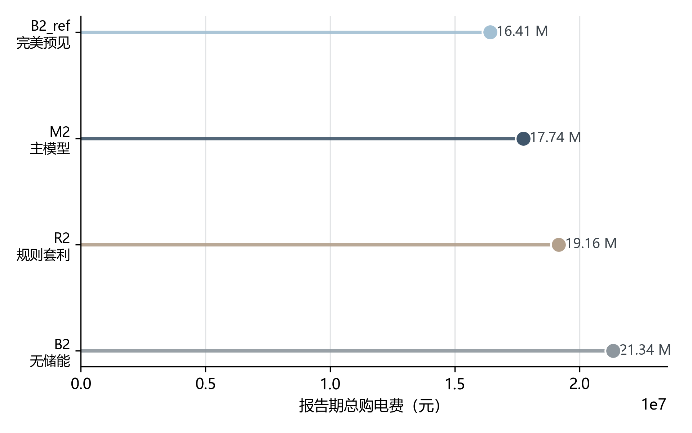

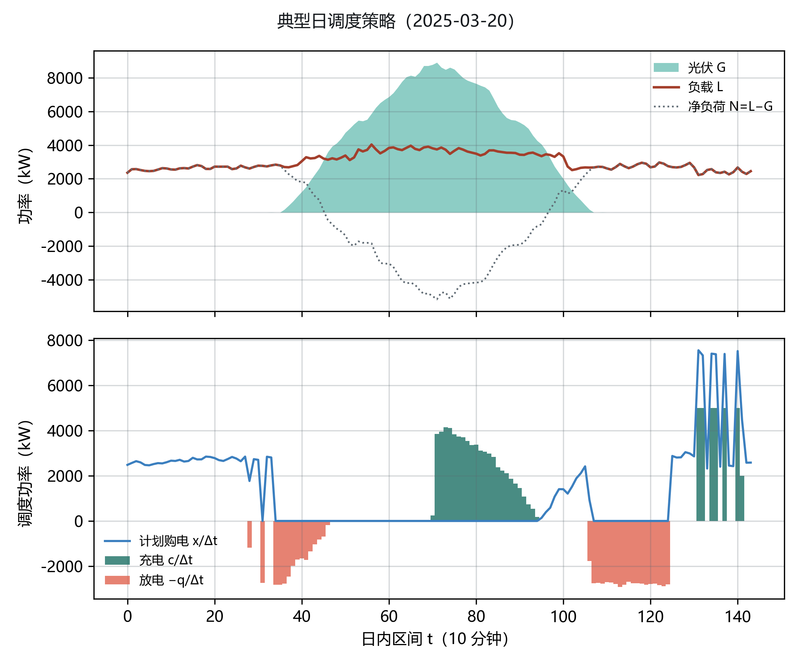

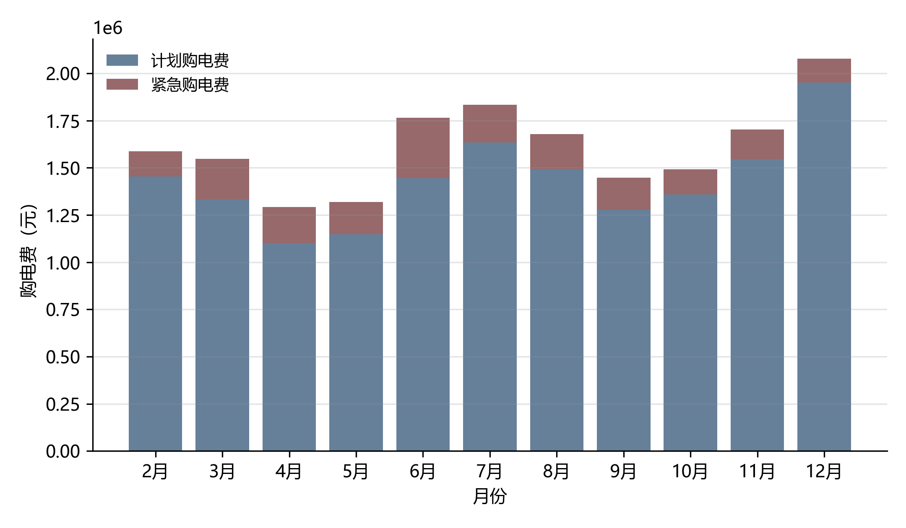

题目要求填写 4 个指定日期（2025-03-20 春分、2025-06-21 夏至、2025-09-23 秋分、2025-12-21 冬至）的购电量、充放电量与紧急购电量，结果如下（完整数据见 `result2.xlsx`，覆盖 2025-02-01~12-31）：

**表 6.2　微网在指定时间段的购电量及全天购电量、购电费（题目表 1）**

| 时间段 | 2025.3.20 | 2025.6.21 | 2025.9.23 | 2025.12.21 |
|---|---:|---:|---:|---:|
| 10:00-10:10 | 0.00 | 0.00 | 0.00 | 0.00 |
| 12:00-12:10 | 619.90 | 0.00 | 556.28 | 1007.94 |
| 14:00-14:10 | 0.00 | 0.00 | 0.00 | 0.00 |
| 16:00-16:10 | 438.55 | 117.65 | 500.98 | 796.49 |
| 18:00-18:10 | 716.09 | 421.00 | 799.87 | 726.66 |
| 20:00-20:10 | 0.00 | 0.00 | 0.43 | 0.00 |
| 全天购电量（kWh） | 68 435.90 | 35 184.63 | 69 659.51 | 98 340.21 |
| 全天购电费（元） | 41 304.43 | 20 037.22 | 43 098.90 | 63 149.78 |

**表 6.3　储能设备在指定时间段的充放电量（题目表 2）**

| 时间段 | 3.20 充 | 3.20 放 | 6.21 充 | 6.21 放 | 9.23 充 | 9.23 放 | 12.21 充 | 12.21 放 |
|---|---:|---:|---:|---:|---:|---:|---:|---:|
| 0:00-4:00 | 4500.00 | 0.00 | 0.00 | 0.00 | 4500.00 | 0.00 | 4500.00 | 0.00 |
| 4:00-8:00 | 833.33 | 5480.10 | 0.00 | 4320.00 | 833.33 | 6339.48 | 1666.67 | 1508.33 |
| 8:00-12:00 | 6062.26 | 3159.90 | 5022.88 | 0.00 | 5902.24 | 2300.52 | 5833.33 | 7806.67 |
| 12:00-16:00 | 5010.21 | 328.71 | 5643.79 | 0.00 | 4984.93 | 178.60 | 8333.33 | 2835.00 |
| 16:00-20:00 | 0.00 | 5727.48 | 0.00 | 6117.79 | 0.00 | 5767.67 | 0.00 | 5656.33 |
| 20:00-24:00 | 5333.33 | 2912.52 | 5333.33 | 2522.21 | 5333.33 | 2872.33 | 5333.33 | 2983.67 |

> 0:00 与 24:00 储电量：四个指定日期均为 6000.00 kWh（逐日滚动约束 $E_0=E_{24}=6000$）。

**表 6.4　指定日期的紧急购电汇总（题目表 3）**

| 日期 | 紧急购电区间数 | 首次紧急购电时段 | 末次紧急购电时段 |
|---|---:|---|---|
| 2025.3.20 | 46 | 0:30-0:40 | 23:50-24:00 |
| 2025.6.21 | 25 | 0:20-0:30 | 22:20-22:30 |
| 2025.9.23 | 43 | 2:20-2:30 | 23:40-23:50 |
| 2025.12.21 | 24 | 1:20-1:30 | 20:10-20:20 |

> 完整逐区间紧急购电量见 `result2.xlsx`（题目表 3）与 `q2_answer_tables.md`；按星期分桶后四个日期区间数趋于均衡（46/25/43/24），未出现单日极端偏差。

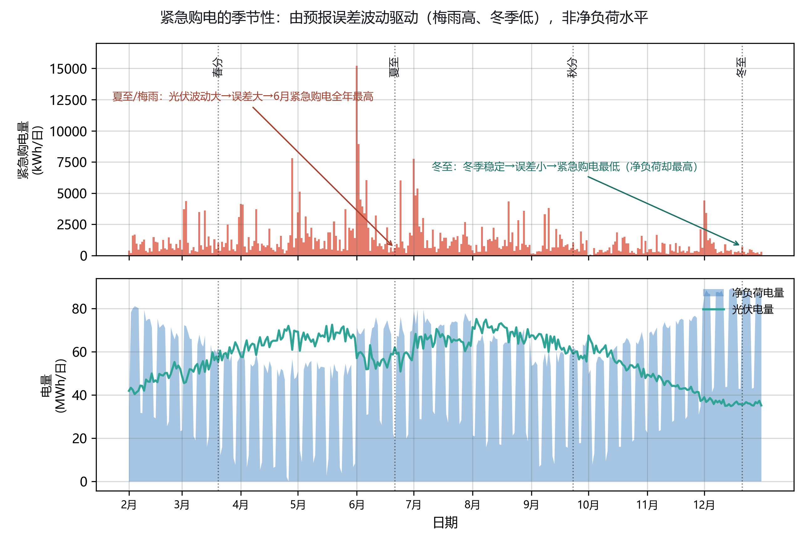

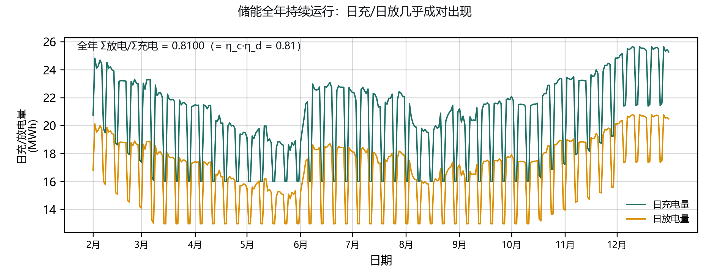

### 6.3 与基准方案对比

在相同信息集（附件 2 历史自预报 + 80 分位风险修正）下构造对照方案：

**表 6.5　问题二各方案报告期总购电费对比**

| 方案 | 说明 | 总购电费（元） |
|---|---|---|
| M2 主模型 | 逐日滚动 LP + 自预报 + 80 分位修正 | **14 559 104.58** |
| R2 规则套利 | 价格阈值贪心充放电 + 缺口购电 | 16 572 068.47 |
| B2 无储能 | 无储能，按安全净负荷直接购电 | 18 172 127.42 |
| B2_ref 无储能·完美预见 | 直接使用真实净负荷（完美预见参照） | 16 407 319.63 |

三项经济价值：

- **储能价值** $=B_2-C_2=3 613 022.84$ 元（占 19.88%）；
- **优化价值** $=R_2-C_2=2 012 963.89$ 元；
- **预报误差成本** $=B_2-B_2^{ref}=1 764 807.79$ 元（信息受限的代价）。

主模型总费用已低于"无储能·完美预见"参照值（该参照仅针对无储能问题，非含储能模型的下界），说明储能套利与风险修正的协同收益足以覆盖预报误差代价。

### 6.4 稳健性检验

五项定向检验结果见表 6.6：

**表 6.6　问题二稳健性检验**

| 编号 | 检验点 | 扰动 | 结果 | 状态 |
|---|---|---|---|---|
| R1 | 风险分位最优性 | $q\in\{0,30,50,70,80,90,95,99\}$ | argmin $q=90$（$q=80$ 仅高 0.67%） | PASS |
| R2 | 预报窗口/加权 | 3/5/7/14 天均匀 vs 7 天加权 | 7 天加权最低（14 天劣化 +4.75%） | CONDITIONAL |
| R3 | 效率口径 | 单向 $\eta=0.9$ vs 往返 0.9 | 总费变化 −3.2% | PASS |
| R4 | 电价线性 | $p\times\{0.9,\dots,1.1\}$ | 精确线性 | PASS |
| R5 | 日末循环约束 | $E_T=E_0$ vs 自由终态 | +0.06% | PASS |

**扩展对照（多场景随机规划 + CVaR）**：构造信息集一致的多场景随机规划（5 个净负荷场景 + CVaR$_{0.9}$，$\rho=0.2$），总费用 14 565 811.29 元，较确定性模型仅高 0.046%，但紧急购电费 −26.2%、紧急购电 >5000 元的日数 −41%，代价是弃光率 +4.5pp。随机规划把尾部风险转移为计划多购/弃光而非降低期望费用，印证报童式固定分位余量在恒定价设定下已足够，故主模型仍取确定性逐日滚动 LP。

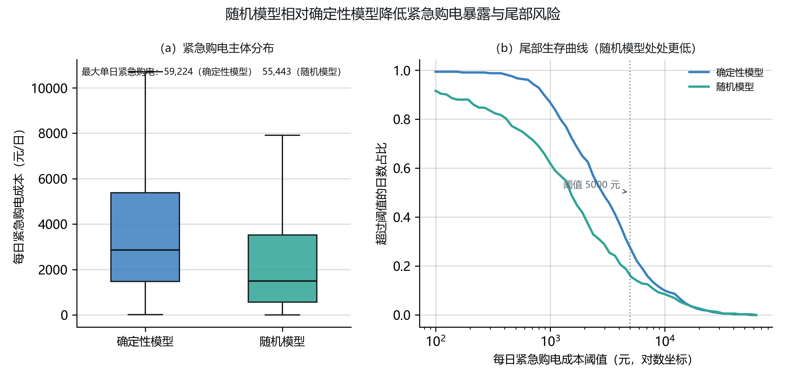

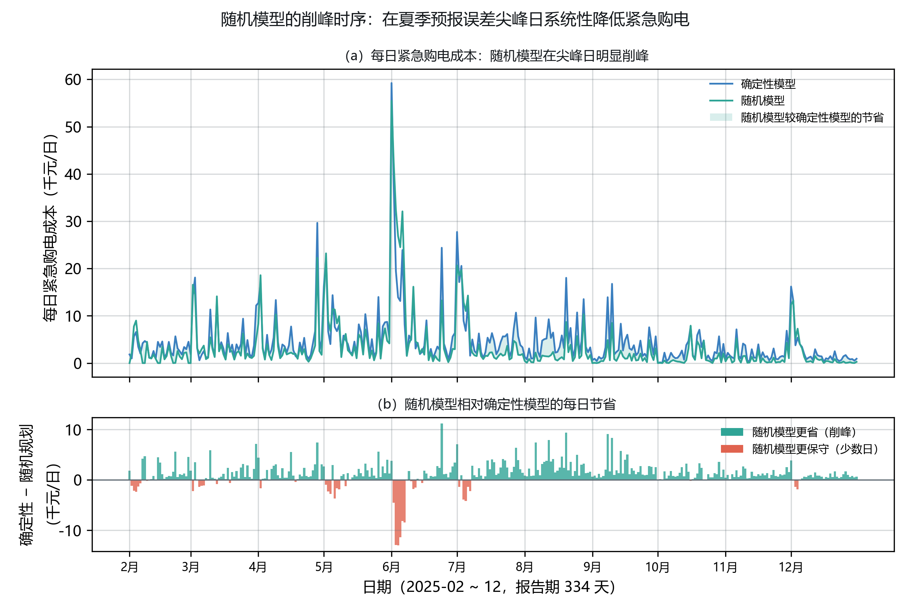

---

## 七、问题三：滚动预报下的计划—调整购电策略模型

### 7.1 模型建立

#### 7.1.1 建模思路与候选方案迭代

问题三在问题二基础上引入 0/6/12/18 四个滚动预报发布时刻与分段计费，建模难点由"是否显式建模预报误差"升级为"误差在何发布时刻、何执行段产生，应如何逐段消除"。本节按迭代顺序交代最终框架的确定过程。

**（1）仅 0:00 计划、不调整（初始尝试）。** 最朴素的思路是沿用问题二的逐日 LP，仅在 0:00 依据当日最早预报制定一次计划并全天执行。其缺陷在于**预报偏差随时间累积**：附件 3 中 6:00 发布的预报对上午时段系统性高估，而 0:00 计划又基于较早、较差的预报，上午的实际缺口无法事后修正，只能由 5 倍紧急购电吸收。实测该静态不调整基线（与主模型同风险修正口径）报告期总费用 17 291 136.58 元，较最终主模型高 3 241 137.30 元（调整价值），说明不引入日内调整将付出高昂代价。

**（2）简单标量风险修正。** 为抑制光伏高估，先尝试对每个发布时刻 $s$ 施加单一标量修正 $\delta_s$（其取值 $\delta_s=[0,1005.49,-6.27,0]$ kW）。但光伏预报误差**随发布时刻与执行时段双重异质**：同一发布时刻的预报，对上午、午后、夜间的偏差方向与幅度各不相同，单一标量无法同时适配，修正后仍遗留可观的紧急购电。

**（3）发布时刻 × 执行 6 h 块区间级修正。** 将修正量推广为"发布时刻 $s$ × 执行 6 h 块"逐 10 分钟区间的分位修正 $\delta_{d,s,t}=P_{80}\big(\hat G_{d,s,t}-G_{d,t}\big)$（形状 $4\times 36$），仅在 $s$ 实际执行的 6 h 块内逐区间取值。该改进使总费用由标量修正的 15 081 833.10 元降至 14 049 999.28 元（**−6.84%**），说明"逐区间分桶"能更精确刻画预报误差的时空异质性，是问题三的核心创新。

**（4）分段计费的线性化。** 分段计费以 $\min(x_{d,t},y_{d,t})$ 与 $\max(\cdot,0)$ 形式进入目标函数，整体呈分段线性且不可微，**无法直接由标准 LP 求解**。为此引入分解 $y_{d,t}=u_{d,t}+v_{d,t}$，并利用目标函数系数关系证明该分解在最优解处自动还原分段结构（详见 7.1.2 节），从而将整日调度保持为 LP。

**（5）多阶段随机规划（SDDP）候选。** 我们还考虑了以多阶段随机规划（SDDP）显式刻画预报不确定性的候选方案，并实际实现一个两阶段随机规划作为扩展对照。之所以不将其作为主模型，原因有三：其一，SDDP 需在场景树上逐节点迭代求解，计算量远大于逐日确定性 LP；其二，场景需从有限历史预报误差中自举出尊重非预见性约束的场景树，主观性强、可复现性差；其三，报童分位修正已使主模型贴近经验最优——分位敏感性中 $q=85$ 仅比 $q=80$ 低 0.21%、目标在 $[80,85]$ 平坦，随机规划的边际收益有限。故仅作对照实验，主模型仍取块级顺序法。

经上述迭代，最终以（3）（4）为核心、配合滚动 MPC 与日闭合约束构成问题三主模型，其严格数学形式见 7.1.2 节。

#### 7.1.2 数学模型

问题三的核心是**信息逐时更新下的滚动决策**：0:00 计划基于当日最早预报，6/12/18 调整利用更接近真实出力的预报修正剩余时段，但调整须按 $\beta_{pen}/\gamma_{pre}$ 计费。光伏预报存在随发布时刻与执行时段双重差异化的系统偏差（6:00 发布的预报对上午系统性高估）。据此建立"**区间级光伏风险修正 + 分段计费线性化 + 滚动时域 MPC**"框架。

**（1）滚动时域机制**。$S=\{0,6,12,18\}$ 四时刻：0:00 制定计划 $x_{d,t}$，6/12/18 各据最新预报对剩余时段重解得 $y_{d,t}$；各段储能与上一段末态连续，每日末回归 $E_0$（日闭合）。


**（2）分段计费与线性化**。报告期总购电费

$$
C_3=\sum_{d,t}p_t\big[\min(x_{d,t},y_{d,t})+\beta_{pen}\max(x_{d,t}-y_{d,t},0)+\gamma_{pre}\max(y_{d,t}-x_{d,t},0)\big]+\sum_{d,t}\alpha_{em}p_t z_{d,t} .
$$

令 $y_{d,t}=u_{d,t}+v_{d,t}$（$0\le u_{d,t}\le x_{d,t}$，$v_{d,t}\ge0$），结算项 $u+\beta_{pen}(x-u)+\gamma_{pre}v$ 中 $u$ 的净系数为 $(1-\beta_{pen})p_t=0.5p_t$、$v$ 的系数为 $\gamma_{pre}p_t=1.5p_t$；因 $(1-\beta_{pen})p_t<\gamma_{pre}p_t$，最优解自动取 $u^*=\min(y,x)$、$v^*=\max(y-x,0)$，等价还原分段结构，整日调度保持 LP。

**（3）区间级光伏风险修正**。按"发布时刻 × 执行 6 h 块"逐 10 分钟区间取 80 分位修正：

$$
\delta_{d,s,t}=P_{80}\big(\hat G_{d,s,t}-G_{d,t}\big),\qquad \hat G^{\mathrm{safe}}_{d,s,t}=\operatorname{clip}_0\big(\hat G_{d,s,t}-\delta_{d,s,t}\big),
$$

其中 $\delta$ 仅在 $s$ 实际执行的 6 h 块（即小时 $[s,s+6)$，对应 1 起点区间 $[6s+1,\,6s+36]$，共 36 个区间）上逐区间取值（形状 $4\times36$），因果滚动估计（`min_hist=7`，无前视泄漏）。分位 $q=80$ 沿用报童临界比 0.8，样本内经验 argmin $q=85$ 与之仅差 0.21%。

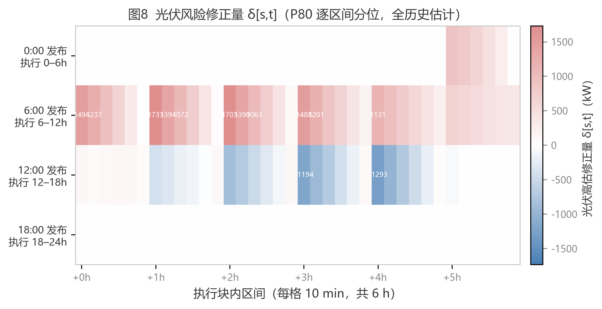

相较逐发布时刻标量修正（round3），块级修正使总费用由 15 081 833.10 元降至 14 049 999.28 元（**−6.84%**）。

**（4）逐日滚动 MPC 与结算**。每日执行四段 LP（1 计划 + 3 调整），各段以各自发布时刻的安全预报为光伏输入，约束为能量平衡 $y_{d,t}+\hat G^{\mathrm{safe}}_{d,s,t}\Delta t+q_{d,t}\ge L_{d,t}\Delta t+c_{d,t}$（每段 $s\in\{0,6,12,18\}$，其中 0:00 计划段 $y_{d,t}=x_{d,t}$）、储能动态与边界、日闭合 $E_T=E_0$。执行后以真实光伏结算，缺口由紧急购电补齐 $z_{d,t}=\max(L_{d,t}\Delta t+c_{d,t}-y_{d,t}-G_{d,t}\Delta t-q_{d,t},0)$。

### 7.2 求解结果

全年报告期 334 天共 **1336 次线性规划**（HiGHS，SEED=2026），单段 <0.1 s。

**表 7.1　主模型 M3 的成本构成**

| 指标 | 数值 |
|---|---|
| 报告期总购电费 $C_3$ | **14 049 999.28 元** |
| 其中：计划购电费 | 12 208 135.40 元 |
| 其中：违约/溢价费 | 1 277 803.18 元 |
| 其中：紧急购电费 | 564 060.69 元 |
| 紧急购电电量 | 145 059.00 kWh |
| 弃光电量 / 弃光率 | 1 914 415.30 kWh / 10.04% |
| 储电量校验 | $E\in[1200,10800]$ 恒成立；$E(0)=E(144)=6000$（日闭合） |

三项费用合计 12 208 135.40 + 1 277 803.18 + 564 060.69 ≈ 14 049 999.28 元（各分项独立四舍五入，合计差 0.01）。紧急购电费仅占 4.01%，区间级 80 分位修正已把"少购被罚"风险控制在低位。

**表 7.2　主模型与各基线的总购电费对比**

| 方案 | 说明 | 总购电费（元） |
|---|---|---|
| **M3 主模型** | 滚动 MPC + 区间级修正 + 储能 | **14 049 999.28** |
| B3 静态不调整 | 仅 0:00 计划并执行 | 17 291 136.58 |
| R3 规则套利 | 滚动预报贪心规则 | 16 956 099.35 |
| B3_ref 无储能·完美预见 | 无储能但已知实际光伏（诊断参照） | 16 407 319.63 |
| NS_fc 无储能·附件3预报 | 无储能 + 0:00 预报（无修正） | 20 128 453.40 |

四项经济价值（冻结绝对值相减）：**调整价值** $=B_3-C_3=3 241 137.30$ 元；**优化价值** $=R_3-C_3=2 906 100.07$ 元；**储能价值** $=NS_{fc}-C_3=6 078 454.12$ 元；**修正价值** $=C_3^{无修正}-C_3=2 920 241.51$ 元。

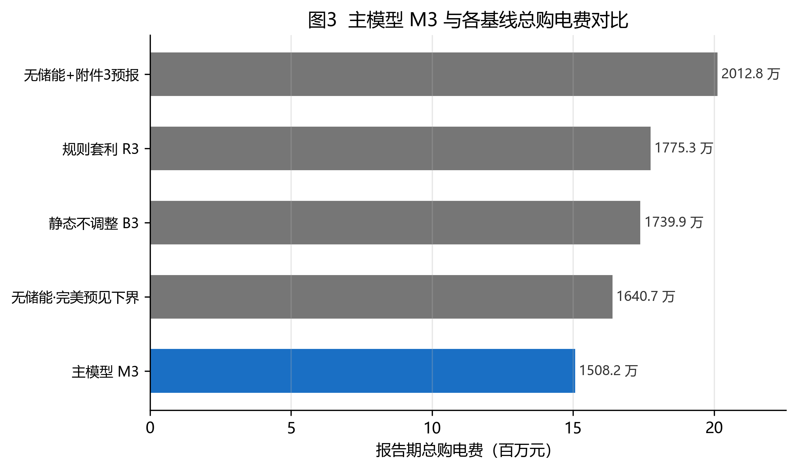

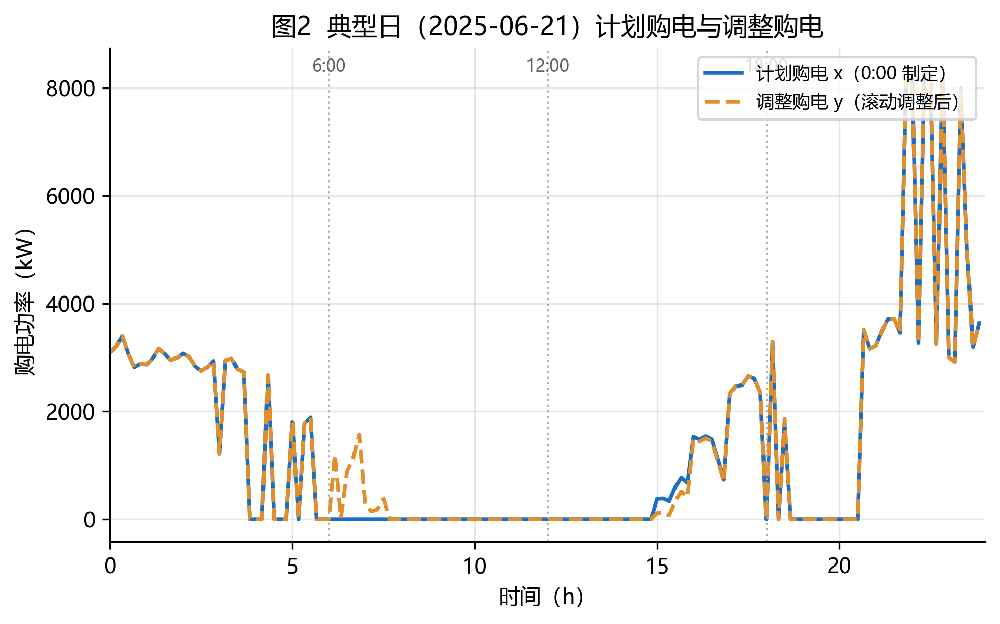


题目要求填写 4 个指定日期（2025-03-20 春分、2025-06-21 夏至、2025-09-23 秋分、2025-12-21 冬至）的计划/调整购电量、充放电量与紧急购电量，结果如下（完整数据见 `result3.xlsx`，覆盖 2025-02-01~12-31）：

**表 7.3　微网在指定时间段的计划购电量（题目表 1，0:00 制定）**

| 时间段 | 2025.3.20 | 2025.6.21 | 2025.9.23 | 2025.12.21 |
|---|---:|---:|---:|---:|
| 10:00-10:10 | 0.00 | 0.00 | 0.00 | 0.00 |
| 12:00-12:10 | 553.56 | 0.00 | 358.67 | 954.54 |
| 14:00-14:10 | 0.00 | 0.00 | 0.00 | 0.00 |
| 16:00-16:10 | 641.13 | 112.92 | 550.19 | 789.89 |
| 18:00-18:10 | 682.35 | 392.37 | 752.64 | 712.63 |
| 20:00-20:10 | 0.00 | 0.00 | 0.00 | 0.00 |
| 全天计划购电量（kWh） | 67 445.61 | 34 408.34 | 68 149.94 | 93 776.07 |

**表 7.4　微网在指定时间段的调整购电量及全天购电量、购电费（题目表 1，滚动调整后执行）**

| 时间段 | 2025.3.20 | 2025.6.21 | 2025.9.23 | 2025.12.21 |
|---|---:|---:|---:|---:|
| 10:00-10:10 | 0.00 | 0.00 | 0.00 | 0.00 |
| 12:00-12:10 | 518.34 | 0.00 | 404.40 | 876.09 |
| 14:00-14:10 | 0.00 | 0.00 | 0.00 | 0.00 |
| 16:00-16:10 | 641.13 | 86.51 | 503.21 | 789.89 |
| 18:00-18:10 | 682.35 | 398.65 | 752.64 | 712.63 |
| 20:00-20:10 | 0.00 | 0.00 | 0.00 | 0.00 |
| 全天调整购电量（kWh） | 66 019.49 | 34 209.59 | 69 157.25 | 95 628.10 |
| 全天购电费（元） | 47 687.44 | 21 128.55 | 46 350.11 | 64 619.65 |

对比表 7.3 与表 7.4，调整购电在 12:00、16:00、18:00 等时段与计划发生分歧（如 6.21 的 16:00-16:10 由 112.92 调至 86.51），体现滚动调整利用新预报修正光伏高估偏差的作用。

**表 7.5　储能设备在指定时间段的充放电量（题目表 2）**

| 时间段 | 3.20 充 | 3.20 放 | 6.21 充 | 6.21 放 | 9.23 充 | 9.23 放 | 12.21 充 | 12.21 放 |
|---|---:|---:|---:|---:|---:|---:|---:|---:|
| 0:00-4:00 | 4500.00 | 0.00 | 0.00 | 583.54 | 4500.00 | 0.00 | 4500.00 | 0.00 |
| 4:00-8:00 | 833.33 | 6074.65 | 11.92 | 3736.46 | 833.33 | 6182.83 | 1666.67 | 1508.33 |
| 8:00-12:00 | 2825.20 | 2565.35 | 3166.05 | 9.65 | 5579.99 | 2457.17 | 5833.33 | 7806.67 |
| 12:00-16:00 | 8108.85 | 421.94 | 7500.62 | 0.00 | 6129.59 | 844.76 | 7854.23 | 2973.67 |
| 16:00-20:00 | 253.54 | 5709.78 | 1.75 | 6155.52 | 0.00 | 5602.91 | 650.30 | 5797.47 |
| 20:00-24:00 | 5333.33 | 2930.22 | 5333.33 | 2485.90 | 5333.33 | 3037.09 | 5333.33 | 2842.53 |
| 全天充电量（kWh） | 21 854.25 | — | 16 013.67 | — | 22 376.24 | — | 25 837.86 | — |
| 全天放电量（kWh） | — | 17 701.94 | — | 12 971.07 | — | 18 124.76 | — | 20 928.67 |

> 0:00 与 24:00 储电量：四个指定日期均为 6000.00 kWh（滚动 MPC 日闭合约束 $E_0=E_{24}=6000$）。

**表 7.6　指定日期的紧急购电汇总（题目表 3）**

| 日期 | 紧急购电区间数 | 全天紧急购电量（kWh） | 首次紧急购电时段 | 末次紧急购电时段 |
|---|---:|---:|---|---|
| 2025.3.20 | 38 | 1 554.81 | 6:10-6:20 | 16:00-16:10 |
| 2025.6.21 | 16 | 163.11 | 4:10-4:20 | 16:20-16:30 |
| 2025.9.23 | 12 | 213.00 | 7:10-7:20 | 18:10-18:20 |
| 2025.12.21 | 15 | 673.92 | 10:00-10:10 | 17:40-17:50 |

> 完整逐区间紧急购电量见 `result3.xlsx`（题目表 3）与 `q3_answer_tables.md`；经按 issue×执行块 逐区间 80 分位光伏风险修正后，6:00 高估缺口转成弃光，紧急购电显著低于未修正方案。

### 7.3 是否需要引入其他预报时刻

**结论：不需要。** 依据有二：

其一，**调整时刻的边际价值递减**（表 7.7、图 7.6）。依次纳入 6:00、12:00、18:00 调整，边际节省依次为 2 779 386.78、461 749.24、1.28 元——18:00 调整的边际贡献仅 1.28 元，几乎为零。

**表 7.7　调整时刻边际价值（阶段消融）**

| 纳入的调整时刻 | 总费用（元） | 边际节省（元） |
|---|---|---|
| 仅 0:00（=B3） | 17 291 136.58 | — |
| + 6:00 | 14 511 749.80 | 2 779 386.78 |
| + 12:00 | 14 050 000.56 | 461 749.24 |
| + 18:00（=M3） | 14 049 999.28 | 1.28 |
| 完美预见下界（4 时刻用实际光伏） | 12 245 046.92 | — |

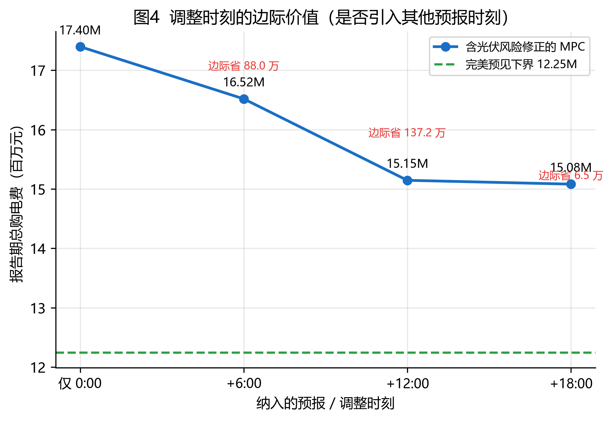

其二，**18:00 后夜间光伏近零、无可修正信息**（图 7.7）：18:00 发布的预报其执行块（18:00–24:00）误差已基本为零，加密预报时刻只会用同样有偏的预报细化窗口，无法消除 6:00 对上午的系统性高估。

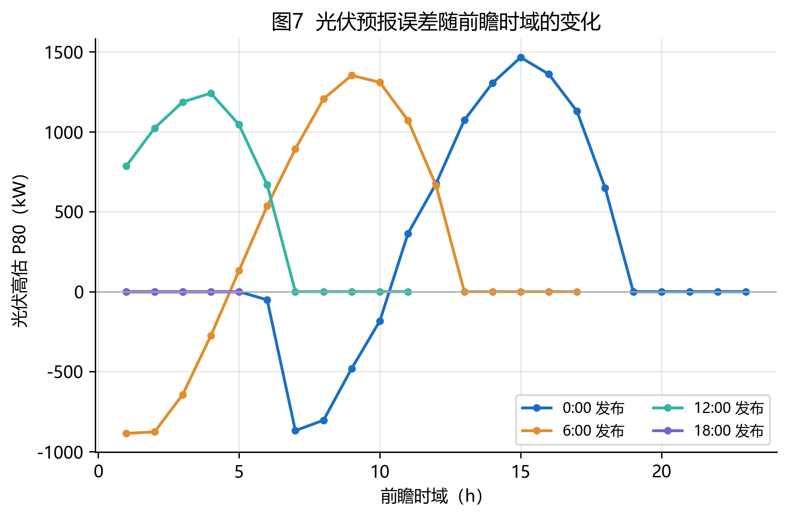

主模型与完美预见下界差距 1 804 952.36 元主因预报精度而非预报频次，进一步提高精度比增加预报时刻收益更大。

### 7.4 稳健性检验

- **风险分位敏感性**：$q$ 全扫描（图 7.8），总费用在 $q=85$ 处最小 14 020 104.48 元，$q=80$ 仅高 0.21%（目标在 $[80,95]$ 平坦）；$q=0$ 时总费用高达 22 498 657.05 元，验证修正方向与适度性都不可忽略。
- **负荷/光伏 ±5% 扰动**：负荷 +5%/−5% 使总费 +9.1%/−8.9%，光伏 +5%/−5% 使总费 −3.5%/+4.6%，近似线性、无放大振荡。
- **扩展对照（两阶段随机规划）**：SP 出样本较主模型低 25.82 万元（−1.84%），增益有限，主模型仍取块级顺序法。

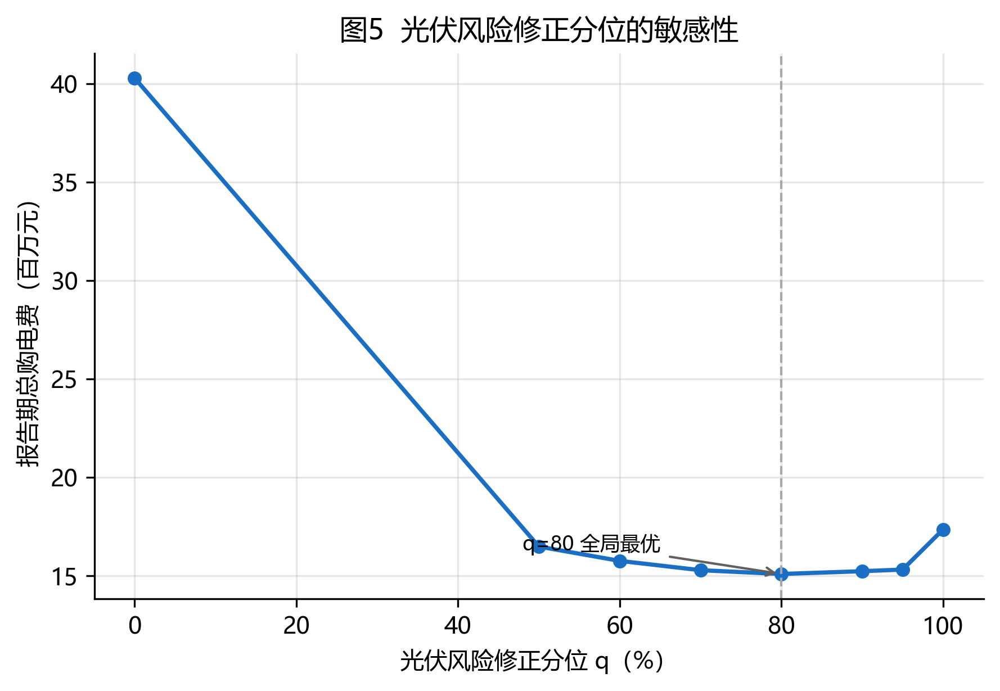

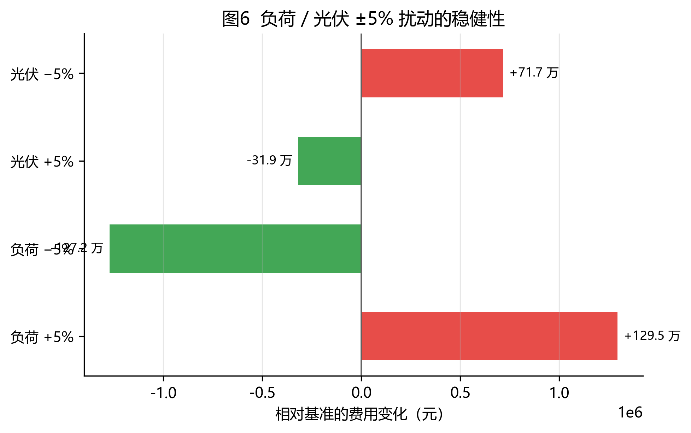

---

## 八、问题四：波动电价下的购电策略模型

### 8.1 模型建立

问题四在结构上完全继承问题二、问题三，唯一变化是电价 $p_t\to p_{d,t}$。但附件 4 波动电价与负荷**正相关**（$\mathrm{corr}(p,L)=+0.508$），即高价时段恰为高负荷时段，带来基础用电成本抬升与储能套利/预报误差损失同时放大的双重效应。故沿用已冻结模型，仅把费用函数中 $p_t$ 替换为 $p_{d,t}$：

- **result4-2**（对应问题二）：净负荷 7 天加权自预报 + 按星期分桶 80 分位修正 + 逐日滚动 LP，总购电费

$$
C_{42}=\sum_{d,t}p_{d,t}\big(x_{d,t}+\alpha_{em}z_{d,t}\big),\quad \alpha_{em}=5 .
$$

- **result4-3**（对应问题三）：滚动 MPC（0/6/12/18）+ 分段计费 + 块级 80 分位光伏修正，总购电费

$$
C_{43}=\sum_{d,t}p_{d,t}\big[\min(x_{d,t},y_{d,t})+\beta_{pen}\max(x_{d,t}-y_{d,t},0)+\gamma_{pre}\max(y_{d,t}-x_{d,t},0)\big]+\sum_{d,t}\alpha_{em}p_{d,t}z_{d,t} .
$$

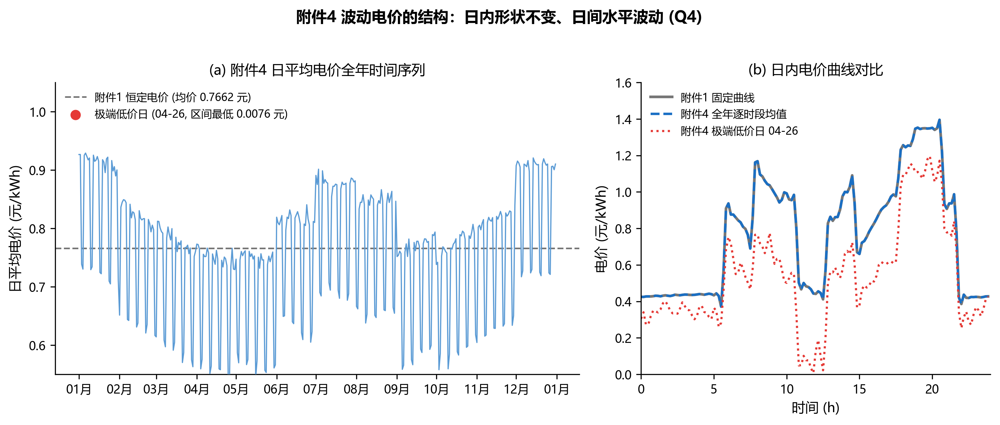

### 8.2 主模型结果

**表 8.1　各方案报告期总购电费对比（334 天）**

| 方案 | 类型 | 总购电费（元） |
|---|---|---|
| 诊断 B：储能 + 完美预见 + 跨日自由结转（理论下界） | 诊断基准 | 12 780 883.29 |
| 诊断 A：储能 + 完美预见 + 日闭合 | 诊断基准 | 12 830 486.39 |
| **主模型 result4-3**：滚动 MPC + 分段计费 + 块级 80 分位修正 | 可执行 | **14 694 112.99** |
| **主模型 result4-2**：逐日滚动 LP + 星期 80 分位修正 | 可执行 | **15 231 785.59** |
| 诊断 B4_ref：无储能 + 完美预见 | 诊断基准 | 17 026 782.86 |
| 基线 R4：规则峰谷套利 + 自预报 | 可执行 | 17 425 496.32 |
| 基线 B4：无储能 + 自预报 + 星期 80 分位 | 可执行 | 18 874 054.20 |

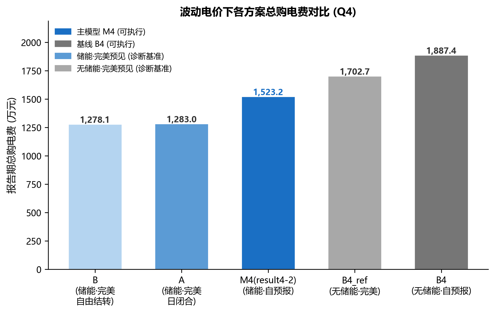

**表 8.2　两套主模型的成本构成**

| 分项 | result4-2（元） | result4-3（元） |
|---|---|---|
| 计划购电费 | 13 600 021.28 | 12 758 457.67 |
| 违约/溢价费 | — | 1 363 165.14 |
| 紧急购电费 | 1 631 764.31 | 572 490.18 |
| **报告期总购电费** | **15 231 785.59** | **14 694 112.99** |
| 紧急购电电量（kWh） | 396 996.49 | 145 152.63 |
| 弃光率 | 13.40% | 10.04% |

result4-3 较 result4-2 低 **537 672.60 元**（−3.53%）：虽因分段计费产生 1 363 165.14 元违约/溢价费，但滚动调整与块级修正将紧急购电费从 1 631 764.31 元压至 572 490.18 元（−64.9%）、紧急购电量 −63.4%，净效果仍优。这与问题二、三的相对关系一致，未因电价波动而改变。

**成本分解（result4-2 口径，表 8.3、图 8.3）**：预报误差是相对理论最优的**唯一主要附加成本**（240.1 万），日闭合约束成本可忽略（5.0 万）。

**表 8.3　result4-2 成本结构分解**

| 层级 | 金额（元） |
|---|---|
| B 理论最优下界（储能 + 完美预见 + 自由结转） | 12 780 883.29 |
| ＋ 日闭合约束成本（A − B） | 49 603.10 |
| ＋ 预报误差附加成本（result4-2 − A） | 2 401 299.20 |
| ＝ 实际 result4-2 | **15 231 785.59** |

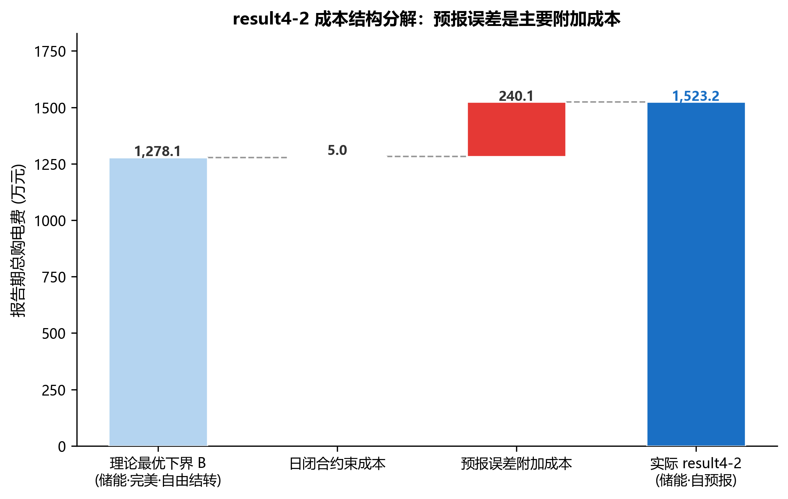

**四项经济价值**（冻结绝对值相减）：储能价值 $=B_4-C_{42}\approx3 642 268.60$ 元；优化价值 $=R_4-C_{42}=2 193 710.73$ 元；预报误差成本（储能侧）$=C_{42}-A=2 401 299.20$ 元；预报误差成本（无储能侧）$=B_4-B_4^{ref}=1 847 271.34$ 元。储能侧预报误差损失比无储能侧高 30.0%——储能更激进利用峰谷，预报偏离被放大为错峰购电与 5 倍紧急购电的双重损失，**预报优化收益上限 ≈ 240 万元**。

### 8.3 恒定电价 vs 波动电价

**表 8.4　恒定电价与波动电价下关键指标对比（result4-2 口径）**

| 指标 | 恒定（附件1） | 波动（附件4） | Δ% |
|---|---|---|---|
| 总购电费（元） | 14 559 104.58 | 15 231 785.59 | +4.62% |
| 储能价值（元） | 3 613 022.84 | 3 642 268.60 | +0.81% |
| 预报误差成本·储能侧（元） | 2 314 057.67 | 2 401 299.20 | +3.77% |
| 储能套利空间（元） | 5 927 080.51 | 6 043 567.81 | +1.97% |
| 日闭合约束成本（元） | 16 880.35 | 49 603.10 | +193.85% |

波动电价放大储能套利空间（+1.97%），但同时抬升基础用电成本（高价与高负荷正相关）并放大预报误差损失（+3.77%），净效应为**总成本 +4.62%**（result4-3 侧 +4.58%，方向一致）。波动电价对作为"买方"的微网总体不利，套利增益不足以抵消基础成本抬升。

### 8.4 稳健性检验

- **风险分位 $q$ 敏感性**（图 8.4）：result4-2 在 $q=90$ 最小（$q=80$ 仅高 0.69%），result4-3 在 $q=85$ 最小（$q=80$ 仅高 0.18%）；$q=80$ 作冻结主值（报童临界比 0.8 不随电价缩放）。
- **电价日间波动幅度 $k$**（图 8.5）：$p^{(k)}=p^{(1)}_t+k(p_{d,t}-p^{(1)}_t)$ 下成本随 $k$ 单调上升，$k=0$ 精确回到 Q2/Q3 冻结值（口径自检 ✓），根源是 TOU 电价与负荷正相关。
- **电价预测不确定性**（图 8.6）：改用因果自预报替换"电价已知"，误差成本仅 +0.90%/+0.80%，远小于净负荷预报误差（240 万），"电价已知"假设稳健。
- **调整时刻消融**（图 8.7）：6:00 首调贡献最大，18:00 近零，滚动调整合计 3 329 369.80 元，结论对"是否加密调整时刻"稳健。
- **极端低价退化检验**：0.0076 元极端低价不引起解退化（储能/充放越界 0 次、无充放同时、紧急与弃光互斥）；弃光率与电价无关。

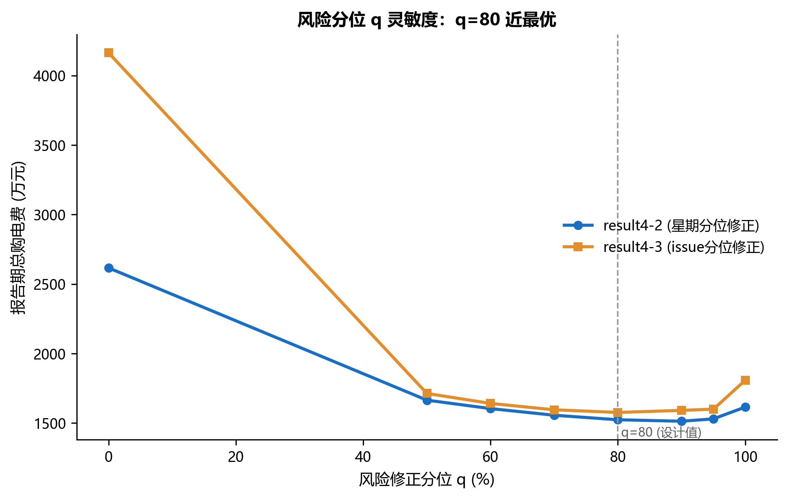

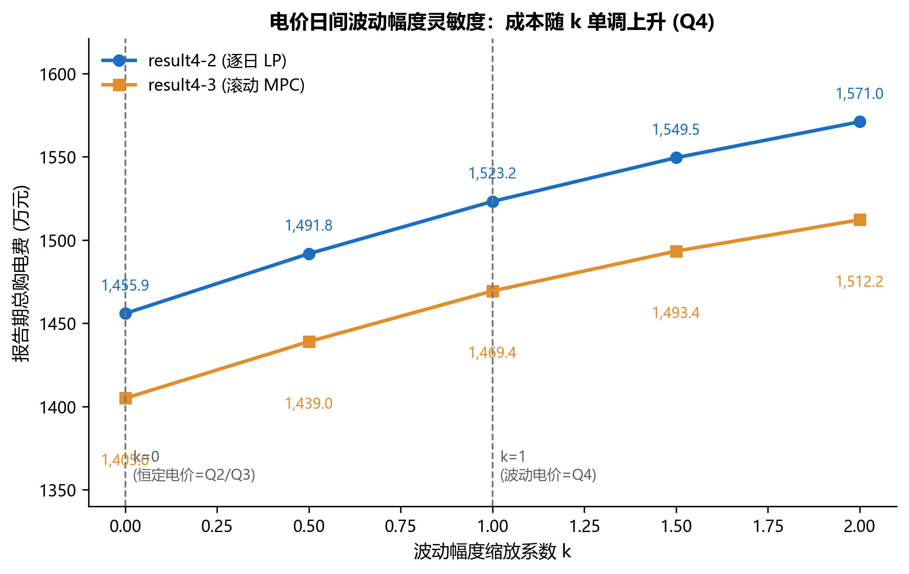

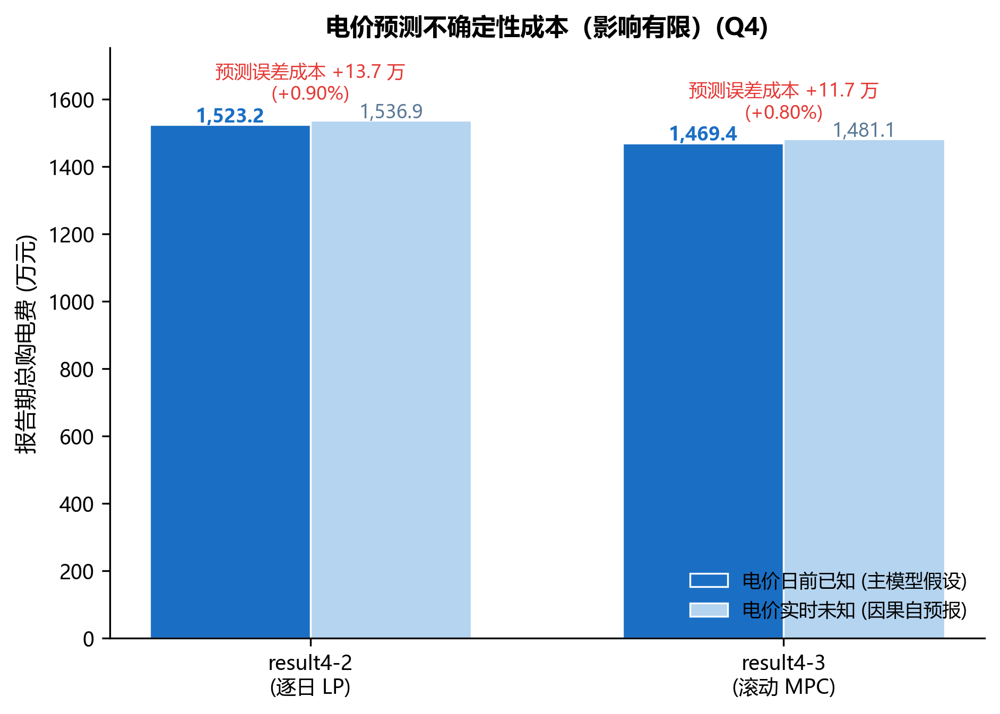

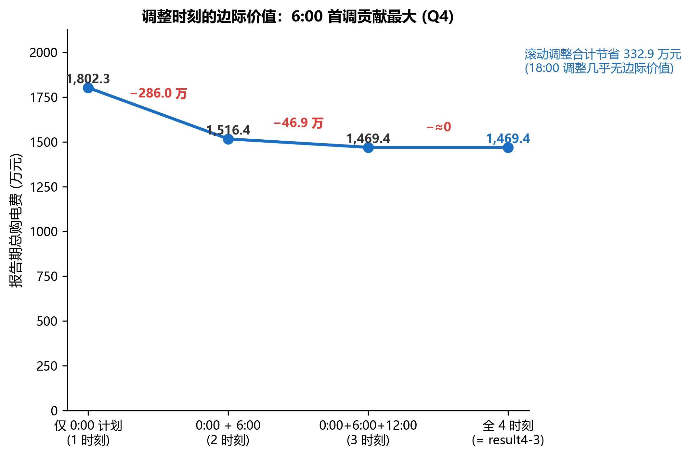

---

## 九、模型评价

### 9.1 模型优点

1. **方法递进、口径统一**：问题一静态 LP → 问题二逐日滚动 LP + 报童风险修正 → 问题三滚动 MPC + 分段计费 → 问题四波动电价重解，四问共享同一能量平衡内核，储能动态与约束结构可整体复用，跨问可比。
2. **风险修正有理论支撑**：80 分位由报童临界比 $q^\star=(\alpha_{em}-1)/\alpha_{em}=0.8$ 解析给出，实测经验 argmin（Q2 为 90、Q3/Q4 为 85）与 $q=80$ 偏差均 <1%，验证取值稳健、非经验调参。
3. **信息集严格合规**：自预报与风险修正仅用当日之前历史，MPC 各调整时刻仅用各自发布时刻预报，无前视泄漏。
4. **精确最优、高效可复现**：LP/MPC 均为确定性求解，HiGHS 毫秒级求解，固定种子保证可复现；分段计费经线性化精确还原为 LP。
5. **结论可溯源**：全部绝对结果引自冻结文件，派生价值由冻结绝对值相减并在正文写明算式。

### 9.2 模型缺点与改进方向

1. **自预报相对简单**：净负荷仅用 7 天加权平均，未引入更复杂时序模型；预报窗口为可调超参数（14 天窗口劣化 +4.75%）。
2. **风险修正未进一步分层**：分位修正按星期（Q2）/发布时刻×执行块（Q3/Q4）分桶，未对季节/天气分层，极端连续阴雨可能仍触发较多紧急购电。
3. **简化假设**：忽略储能退化/自放电/维护成本；光伏预报沿用整点阶梯映射，未建模 10 分钟内的次小时波动。
4. **电价假设**：Q4 主模型视电价为日前已知（已量化其代价 <1%）；完美预见参照不可执行，仅作诊断基准。

上述不足可由更精细的时序预报、分层风险修正与电池退化模型进一步弥补，模型框架已为这些扩展预留接口。

---

## 参考文献

[1] 全国大学生数学建模竞赛组委会. 2026 年高教社杯全国大学生数学建模竞赛 C 题：微网与外部电网电力调控策略. 2026.

[2] 姜启源, 谢金星, 叶俊. 数学模型（第四版）[M]. 北京: 高等教育出版社, 2011.

[3] Dantzig G B. Linear Programming and Extensions[M]. Princeton: Princeton University Press, 1963.

[4] Huangfu Q, Hall J A J. Parallelizing the dual revised simplex method[J]. Mathematical Programming Computation, 2018, 10(1): 119–142.

[5] Silver E A, Pyke D F, Peterson R. Inventory Management and Production Planning and Scheduling[M]. 3rd ed. New York: John Wiley & Sons, 1998.

[6] Lasseter R H. MicroGrids[C]. IEEE Power Engineering Society Winter Meeting, 2002, 1: 305–308.

[7] Kaur S, Gupta S. Energy Management in Microgrid using Linear Programming Optimization[C]. 2024 15th International Conference on Computing Communication and Networking Technologies (ICCCNT). IEEE, 2024. DOI: 10.1109/ICCCNT61001.2024.10726110.

[8] Lautert R R, Cambambi C A C, Ortiz M S, Wolter M, Canha L N. Optimal power dispatch in microgrids using mixed-integer linear programming[J]. Automatisierungstechnik, 2024, 72(11): 1030–1040. DOI: 10.1515/auto-2024-0094.

[9] Alguhi A A, Alotaibi M A. Optimal Operation of Battery Energy Storage Systems in Microgrid-Connected Distribution Networks for Economic Efficiency and Grid Security[J]. Energies, 2025, 18(23): 6335. DOI: 10.3390/en18236335.

---

## 附录

### 附录 A　主模型核心代码

问题一通过共享核心 `common.daily_lp` 求解，将能量平衡、储能动态与边界、终态闭合组装为标准 LP 交由 HiGHS 求解：

```python
# common.daily_lp —— 单日线性规划核心（节选）
def daily_lp(price, load, pv, E0=None, terminal_eq=False, E_term=None):
    n = 3 * T + (T + 1)                 # x(144) + c(144) + q(144) + E(145)
    cobj = np.zeros(n); cobj[0:T] = price            # 目标: Σ p_t x_t
    # 能量平衡: -x - q + c <= pv*Δt - load*Δt
    # 储能动态: E_{t+1} - E_t - ηc·c_t + q_t/ηd = 0
    # 边界: x,c,q >= 0; E ∈ [Emin, Emax]; E_0 = E_T = 6000
    res = linprog(cobj, A_ub=..., b_ub=..., A_eq=..., b_eq=...,
                  bounds=..., method="highs")
    return float(res.fun), x, c, q, E
```

问题二/三/四在此原子模型上逐日滚动（问题二）或分段 MPC（问题三/四），仅替换电价与预报输入。

### 附录 B　结果文件索引

| 文件 | 内容 |
|---|---|
| `results/Q1/result1.xlsx` | 问题一表 1（购电量）+ 表 2（充放电量 + 储电量） |
| `results/Q2/result2.xlsx` | 问题二全年购电策略 + 紧急购电 |
| `results/Q3/result3.xlsx` | 问题三计划/调整/紧急购电策略 |
| `results/Q4/result4-2.xlsx`、`result4-3.xlsx` | 问题四两套策略 |
| `results/Q1~Q4/reports/frozen_numbers.json` | 各问冻结数值（本文全部数值唯一权威来源） |
| `planning/symbol_table.md` | 统一符号表 |
| `paper/figures/` | 本文全部图（300 dpi PNG + SVG） |
