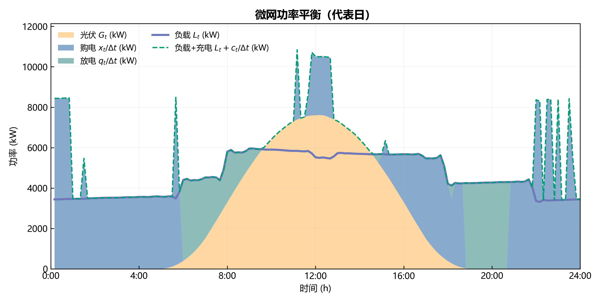
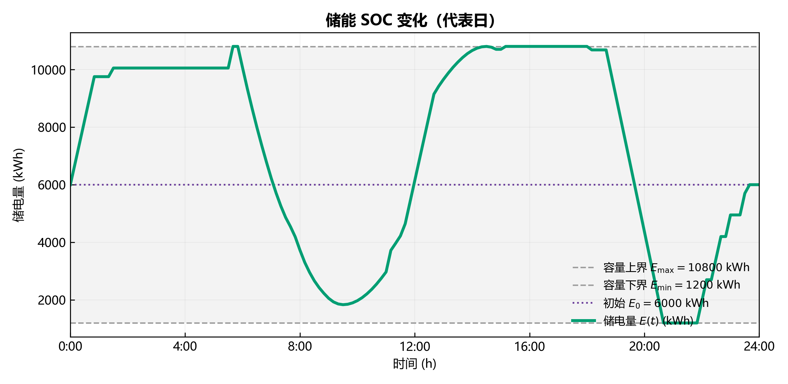
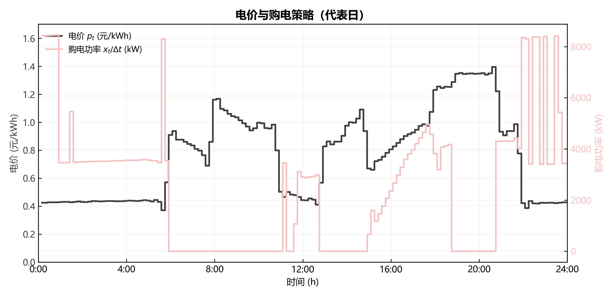

# 基于线性规划的微网单日最优购电调度策略

> 2026 年高教社杯全国大学生数学建模竞赛 C 题「微网与外部电网电力调控策略」——问题一
>
> 数值均引自冻结结果 `results/frozen_numbers.json` 与稳健性报告 `results/reports/robustness_report.json`；符号统一遵循 `planning/symbol_table.md`。

---

## 摘要

微网在分时电价下如何调度购电与储能，以最低成本满足小区负载，是问题一的核心。本文将问题一抽象为**单日静态线性规划**：以代表日 144 个 10 分钟区间的计划购电量 $x_t$、储能充电量 $c_t$、放电量 $q_t$ 为决策变量，以全天购电费 $C_1=\sum_{t=1}^{T}p_t x_t$ 最小为目标，在"供电不低于负载"、储能容量与充放电功率边界、"0:00 与 24:00 储电量相等"三类约束下求解。模型含 577 个连续变量，全部约束与目标线性，用 HiGHS 求解器 0.014 s 得到全局最优解。

求解结果：全天购电费为 **35126.95 元**，总购电量 59482.70 kWh，储能累计充电 20740.67 kWh、放电 16799.94 kWh，终态储电量 $E_0=E_T=6000$ kWh 严格闭合。储能呈现清晰的"谷充峰放"：低价时段完成 85.67% 的充电量，高价时段完成 84.90% 的放电量。与**无储能基准**（48052.05 元）相比，储能调度使购电费下降 12925.10 元（**26.90%**）；与**规则峰谷套利基准**（46143.08 元）相比再降 11016.13 元，验证了线性规划相对启发式规则的优化价值。

敏感性分析表明：电价 ±5% 时费用线性 ±5.0%，负载 ±5% 时费用 +10.55% / −10.18%，模型对输入扰动无放大效应；充放电效率方向（单向 0.9 与往返 $\sqrt{0.9}$ 两种口径）下费用差异约 3.77%，不改变储能经济价值的定性结论。模型物理自洽、结果可复现，为后续滚动调度（问题二至问题四）提供了单日基准与统一的储能动态。

**关键词**：微网；线性规划；储能调度；峰谷套利；购电费用最小化

---

## 一、问题重述

### 1.1 问题背景

非孤岛式微网由分布式光伏、储能设备与小区负载构成，并与外部电网存在电能交易。微网可向外部电网购电、也可在光伏富余或电价较低时向储能充电、在电价较高或供电紧张时由储能放电，从而在满足负载的前提下尽量降低购电支出。

### 1.2 问题一的具体要求

问题一给定**某天**（下文称"代表日"）的分时电价 $p_t$、小区负载功率 $L_t$、光伏预测功率 $\hat G_t$（$t=1,2,\dots,T$，$T=144$ 个 10 分钟区间），以及附录 1 给出的储能设备参数（额定容量 12000 kWh、运行储电量区间 $[1200,10800]$ kWh、最大充/放电功率 5000 kW、充放电效率 90%、初始储电量 6000 kWh）。

要求确定各区间计划购电量 $x_t$、储能充电量 $c_t$、放电量 $q_t$ 及储电量 $E_t$，使得：

1. **供电约束**：任一区间微网供电（购电 + 光伏 + 放电）不低于小区负载；
2. **储能约束**：储能量始终落在 $[E_{\min},E_{\max}]$ 内，充/放电功率不超上限；
3. **终态闭合**：0:00 与 24:00 时刻储电量相等（保证日周期可重复运行）；
4. **目标**：全天购电费最小。

输出为 144 个区间的购电量（表 1）与 6 段汇总的充放电量及 0:00/24:00 储电量（表 2）。

---

## 二、问题分析

问题一是一个**确定性、单目标、连续变量的静态优化问题**：

- **决策对象**：每个区间的购电量 $x_t$、充电量 $c_t$、放电量 $q_t$、储电量 $E_t$ 均为连续非负变量，不存在"启停""档位"等整数决策。
- **目标与约束均为线性**：目标函数为电价的线性加权和，能量平衡、储能动态、容量与功率边界均为线性（不）等式。
- **经济驱动**：分时电价存在峰谷差（代表日电价区间约 $[0.3713, 1.3952]$ 元/kWh），储能具备"低价充电、高价放电"的套利空间，这是模型能够降低购电费的根本原因。
- **日周期闭合**：0:00 与 24:00 储电量相等，使单日调度可被逐日重复，是全年连续调度的必要条件。

上述结构使问题一可精确建模为**线性规划（LP）**。线性规划具有全局最优性保证，且求解规模（577 变量、578 个线性约束）对现代求解器（HiGHS）而言仅需毫秒级，可精确求得最优购电策略，无需依赖启发式规则或近似算法。

---

## 三、模型假设

在建模前，我们作如下必要与简化假设（符号统一见第四节）。

**必要假设**（保证模型正确性与可解性）：

| 编号 | 假设内容 | 说明 |
|---|---|---|
| A1 | 一天离散为 $T=144$ 个等长 10 分钟区间，区间内功率视为恒定，区间电量 = 功率 × $\Delta t$ | 题目按 10 分钟输出购电量，离散化是建立有限维优化的前提 |
| A2 | 微网供电（购电 + 光伏 + 放电）必须不低于小区负载 | 题目硬约束"不可低于负载" |
| A3 | 储能量 ∈ $[E_{\min},E_{\max}]=[1200,10800]$ kWh，充/放功率 ≤ 5000 kW，初始 $E_0=6000$ kWh | 附录 1 给定参数 |
| A4 | 区间电量取该区间**起点**功率 × $\Delta t$（144 个功率点对应 144 个区间） | 区间功率—电量折算口径 |
| A5 | 充放电效率为**单向** 0.9：充电使储能增加 $\eta_c c$，放电使储能减少 $q/\eta_d$，$\eta_c=\eta_d=0.9$ | 效率方向口径，见敏感性分析 |
| A6 | 能量平衡口径：$x + \hat G\,\Delta t + q \ge L\,\Delta t + c$，光伏富余可用于充电 | 区间级能量守恒 |

**简化假设**：

| 编号 | 假设内容 | 说明 |
|---|---|---|
| S1 | 问题一使用"代表日"：附件 1 负载 = 附件 2 全年各时点均值（精确相等），电价 = 附件 4 全年均值 | 数据审计结论，Q1 为典型日基准 |
| S2 | 计划购电量无上限（外网购电能力充足） | 题目未给购电上限 |
| S3 | 储能同区间不边充边放（$c_t q_t = 0$） | 成本最小化且效率 < 1 时同区间充放恒非最优，可由最优性自然满足 |
| S4 | 光伏全额本地消纳，可直供负载或充储能 | 目标为最小化购电费，弃光不省钱，默认全额消纳 |
| S5 | 忽略储能自放电、线路损耗与维护成本 | 题目未提及，对单日经济性影响次要 |

---

## 四、符号说明

| 符号 | 含义 | 单位 |
|---|---|---|
| $t$ | 区间序号，$t=1,\dots,T$ | — |
| $T$ | 每日区间数（$T=144$） | — |
| $\Delta t$ | 区间时长（$\Delta t=1/6$ h） | h |
| $p_t$ | 区间 $t$ 的恒定分时电价（附件 1） | 元/kWh |
| $L_t$ | 区间 $t$ 的小区负载功率（附件 1） | kW |
| $\hat G_t$ | 区间 $t$ 的光伏预测功率（附件 1） | kW |
| $x_t$ | 区间 $t$ 的计划购电量 | kWh |
| $c_t$ | 区间 $t$ 的储能充电量 | kWh |
| $q_t$ | 区间 $t$ 的储能放电量 | kWh |
| $E_t$ | 区间 $t$ 结束时刻的储电量 | kWh |
| $E_{\min},E_{\max}$ | 储能量下限/上限（1200 / 10800） | kWh |
| $P_{\max}^{c},P_{\max}^{d}$ | 最大充/放电功率（5000） | kW |
| $\eta_c,\eta_d$ | 充/放电效率（0.9） | — |
| $E_0$ | 初始（0:00）储电量（6000） | kWh |
| $C_1$ | 问题一全天购电费 | 元 |

> 说明：问题一为单日问题，故省略日期下标 $d$（即 $x_t\equiv x_{d,t}$ 在 $d$ 固定时的记法），其余符号严格遵循 `planning/symbol_table.md`。

---

## 五、模型建立与求解

### 5.1 决策变量

对每个区间 $t=1,\dots,T$，决策变量为计划购电量 $x_t\ge 0$、充电量 $c_t\ge 0$、放电量 $q_t\ge 0$；状态变量为区间末储电量 $E_t$（$E_0$ 为给定初值）。变量总数 $3T+(T+1)=577$。

### 5.2 目标函数

问题目标是最小化全天购电费，即

$$
\min \quad C_1 = \sum_{t=1}^{T} p_t\, x_t . \tag{1}
$$

### 5.3 约束条件

**（a）能量平衡约束**（供电不低于负载，光伏与放电可共同供给）：

$$
x_t + \hat G_t\,\Delta t + q_t \;\ge\; L_t\,\Delta t + c_t ,\qquad t=1,\dots,T . \tag{2}
$$

**（b）储能动态约束**（单向效率）：

$$
E_t = E_{t-1} + \eta_c\, c_t - \frac{q_t}{\eta_d},\qquad t=1,\dots,T . \tag{3}
$$

**（c）充放电功率与容量边界**：

$$
0\le c_t \le P_{\max}^{c}\,\Delta t,\qquad 0\le q_t \le P_{\max}^{d}\,\Delta t,\qquad E_{\min}\le E_t \le E_{\max} . \tag{4}
$$

**（d）终态闭合约束**（0:00 与 24:00 储电量相等）：

$$
E_0 = E_T = 6000\ \text{kWh} . \tag{5}
$$

式 (1)–(5) 构成一个标准的连续线性规划：目标与约束均关于决策变量线性，故其任意局部最优即为全局最优。

### 5.4 求解方法

该 LP 规模为 577 个变量（$3T+(T+1)$）、578 个线性约束（432 个不等式 + 146 个等式）。我们调用 `scipy.optimize.linprog(method="highs")`（HiGHS 求解器）求解，耗时约 0.014 s。

关于"同区间边充边放"：由于充放电效率 $\eta_c=\eta_d=0.9<1$，同一区间同时充电与放电必然产生无谓能量损失，在成本最小化下恒非最优，故最优解自动满足 $c_t\,q_t=0$（数值核验：144 个区间中同区间同时充放的个数为 0），无需引入二进制互斥约束。

---

## 六、模型求解结果与分析

### 6.1 优化结果

求解得到的代表日最优调度结果如下（数值引自 `frozen_numbers.json`）：

| 指标 | 数值 |
|---|---|
| 全天购电费 $C_1$ | **35126.95 元** |
| 总购电量 $\sum_t x_t$ | 59482.70 kWh |
| 储能累计充电量 $\sum_t c_t$ | 20740.67 kWh |
| 储能累计放电量 $\sum_t q_t$ | 16799.94 kWh |
| 0:00 储电量 $E_0$ | 6000 kWh |
| 24:00 储电量 $E_T$ | 6000 kWh |

图 1–图 3 分别给出微网功率平衡、储能 SOC 轨迹、电价—购电调度三类证据。



**图 1　代表日微网功率平衡**（负载、光伏、购电、储能充放电功率逐区间分布；白天光伏富余被储能吸收，夜间与晚高峰由储能放电削减购电）。



**图 2　储能储电量 $E_t$ 变化曲线**（全程落在 $[1200,10800]$ kWh 内，$E(0)=E(24)=6000$ kWh，终态闭合）。



**图 3　分时电价与购电策略**（低价时段增购/充电、高价时段减购/放电，体现经济调度）。

### 6.2 与基准方案的对比

为量化储能与优化的价值，构造两个基准方案并与主模型对比：

| 方案 | 全天购电费（元） | 较主模型节省（元） |
|---|---|---|
| 主模型 M1（线性规划） | 35126.95 | — |
| 基准 B1（无储能） | 48052.05 | 12925.10 |
| 基准 R1（规则峰谷套利） | 46143.08 | 11016.13 |

- **储能价值**：主模型较无储能基准 B1 节省 12925.10 元，占比 26.90%（引自冻结指标 `储能价值_占比`），即"引入储能 + 优化调度"的经济价值；
- **优化价值**：主模型较规则峰谷套利 R1 再节省 11016.13 元，即"线性规划相对启发式规则"的优化价值。

对比表明：储能削峰填谷是本问题降本的主要来源，而线性规划相比简单规则进一步提升了约 1.1 万元的收益，验证了精确优化的必要性。

### 6.3 峰谷套利行为分析

按电价分段统计储能的充放电能量（引自 `methods/Q1/q1_reasonableness_analysis.md`）：

| 电价区间 | 区间数 | 充电量（kWh） | 放电量（kWh） | 行为 |
|---|---|---|---|---|
| 低价（$p<0.55$） | 58 | 17769.5 | 0.0 | 集中充电 |
| 平价（$0.55\le p\le 0.85$） | 20 | 1130.0 | 2537.6 | 少量调整 |
| 高价（$p>0.85$） | 66 | 1841.1 | 14262.4 | 集中放电 |

- 低价充电占比 $= 17769.5/20740.7 = 85.67\%$；
- 高价放电占比 $= 14262.4/16799.9 = 84.90\%$。

对"高价区间仍存在 1841.1 kWh 充电"的核查表明：这些区间的购电量 $x_t=0$，且光伏 $\hat G_t\,\Delta t > L_t\,\Delta t$（午间光伏富余），充电完全来自免费光伏消纳，而非"高买低卖"。因此储能呈现清晰的**谷充峰放**经济行为，与峰谷电价套利的预期一致。

### 6.4 约束满足性验证

最优解逐区间核验（引自 `methods/Q1/q1_reasonableness_analysis.md` 与 `results/reports/robustness_report.json`）：

| 检验项 | 结果 | 结论 |
|---|---|---|
| 能量平衡残差最大绝对值 | $2.27\times10^{-13}$ kWh | 全部 144 区间满足"供电 ≥ 负载"，且近似取等（代表日无弃光、无缺口） |
| 储能量越界区间数 | 0 | $E_t\in[1200,10800]$ 全程成立 |
| 充/放电功率越界区间数 | 0 | 充电最大 5000.00 kW 恰达上限，放电最大 4293.92 kW，均 ≤ 5000 kW |
| 同区间同时充放区间数 | 0 | 满足 $c_t q_t=0$ |
| 终态闭合 | $E_0=E_T=6000$ kWh | 严格成立 |

储能量轨迹 $6000\to 10800$（5:40–5:50 充满）$\to 1974$（10:00）$\to 10800$（14:30–18:00）$\to 1200$（20:40–21:50 放空）$\to 6000$（24:00），完成"夜间谷充 → 早高峰放 → 午间光伏再充 → 晚高峰放空 → 夜间回充"的完整循环，且首尾闭合，具备日周期可重复调度能力。

---

## 七、稳健性与敏感性分析

对模型的关键输入与口径进行扰动检验（数据引自 `results/reports/robustness_report.json`，基准费用 35126.95 元）：

### 7.1 电价敏感性

| 扰动 | 费用变化率 |
|---|---|
| 电价 +5% | +5.0% |
| 电价 −5% | −5.0% |

费用对电价呈**严格线性**响应（目标函数为电价的线性函数），无放大或悬崖效应，模型对电价波动稳健。

### 7.2 负载敏感性

| 扰动 | 费用变化率 |
|---|---|
| 负载 +5% | +10.55% |
| 负载 −5% | −10.18% |

负载增加 5% 使费用上升约 10.55%，高于电价的同幅度影响，这是因为负载抬升同时压缩了储能套利的可行空间（更多电量需直接购电）。响应仍为平滑、无突变的线性量级，模型稳健。

### 7.3 充放电效率方向敏感性

效率方向（HD2）是全局 load-bearing 假设，检验单向效率 0.9 与往返效率 $\sqrt{0.9}$ 两种口径：

| 口径 | 全天购电费（元） | 差异率 |
|---|---|---|
| 单向效率 $\eta_c=\eta_d=0.9$ | 35126.95 | — |
| 往返效率 $\eta_c=\eta_d=\sqrt{0.9}$ | 33801.5 | −3.77% |

两种口径下费用差异约 3.77%，不改变"储能削峰填谷显著降低购电费（较无储能下降约 26.9%）"的定性结论，说明模型对效率方向的选取不敏感。

### 7.4 讨论

综合来看，模型对电价、负载扰动呈线性或近线性响应，无输入扰动被非线性放大的情形；对效率方向这一关键建模口径亦不敏感。因此，问题一的求解结果在数值上是稳健的，核心结论（储能价值约 26.9%、优化价值约 1.1 万元）具有可信度。

---

## 八、模型评价

### 8.1 模型优点

1. **精确最优**：线性规划具有全局最优性保证，求解结果可证明为最优购电策略，而非启发式近似。
2. **物理自洽**：能量平衡、储能容量/功率边界、终态闭合三类约束全部满足，充放电互斥由最优性自然成立。
3. **计算高效、可复现**：577 变量在 0.014 s 内求解，固定随机种子（SEED=2026）与确定性 LP 保证结果可复现。
4. **可迁移**：单日 LP 是问题二（全年联合/滚动）与问题四（波动电价）的原子模型，储能动态与约束结构可整体复用。

### 8.2 模型缺点与改进方向

1. **代表日局限**：附件 1 为"年均代表日"（负载=全年均值、电价=全年均值），问题一结果仅反映典型日，不能覆盖极端日（如全年最高光伏、极低电价日）。
2. **完美预见假设**：问题一假设光伏预测精确、负载已知，未建模预报误差，真实调度中预报偏差需由后续滚动机制（问题三）吸收。
3. **忽略电池退化**：未计储能循环损耗、退化与维护成本，长期经济性需另行评估。

上述不足分别由问题二（逐日实际负载/光伏）、问题三（滚动预报 + 调整）与更精细的电池退化模型加以弥补。

---

## 参考文献

[1] Kaur, S., Surbhi. Energy Management in Microgrid using Linear Programming Optimization. *2024 15th International Conference on Computing Communication and Networking Technologies (ICCCNT)*. IEEE, 2024. DOI: 10.1109/ICCCNT61001.2024.10726110.

[2] Lautert, R. R., Cambambi, C. A. C., Ortiz, M. S., Wolter, M., Canha, L. N. Optimal power dispatch in microgrids using mixed-integer linear programming. *Automatisierungstechnik*, 2024, 72(11): 1030–1040. DOI: 10.1515/auto-2024-0094.

[3] Alguhi, A. A., Alotaibi, M. A. Optimal Operation of Battery Energy Storage Systems in Microgrid-Connected Distribution Networks for Economic Efficiency and Grid Security. *Energies*, 2025, 18(23): 6335. DOI: 10.3390/en18236335.

[4] 全国大学生数学建模竞赛组委会. 2026 年高教社杯全国大学生数学建模竞赛 C 题：微网与外部电网电力调控策略. 2026.

---

## 附录

### 附录 A　主模型核心代码（`code/Q1/q1_main.py` 与 `code/common.py`）

问题一通过调用共享核心 `common.daily_lp` 求解。该函数将式 (1)–(5) 组装为标准 LP 并交由 HiGHS 求解：

```python
# common.daily_lp —— 单日线性规划核心（节选）
def daily_lp(price, load, pv, E0=None, terminal_eq=False, E_term=None):
    n = 3 * T + (T + 1)                 # x(144) + c(144) + q(144) + E(145)
    cobj = np.zeros(n); cobj[0:T] = price            # 目标: Σ p_t x_t
    # 能量平衡: -x - q + c <= pv*Δt - load*Δt  (即 x+GΔt+q >= LΔt+c)
    # 充/放电功率: c <= Pmax*Δt, q <= Pmax*Δt
    # 储能动态: E_{t+1} - E_t - ηc·c_t + q_t/ηd = 0
    # 边界: x,c,q >= 0; E ∈ [Emin, Emax]; E_0 = E_T = 6000
    res = linprog(cobj, A_ub=..., b_ub=..., A_eq=..., b_eq=...,
                  bounds=..., method="highs")
    return float(res.fun), x, c, q, E
```

`q1_main.py` 求解主模型 M1，并用 `no_storage` 与 `rule_arbitrage` 计算两个基准 B1/R1，随后将 144 个区间购电量与 6 段汇总充放电量写入 `results/Q1/result1.xlsx`。

### 附录 B　结果文件索引

| 文件 | 内容 |
|---|---|
| `results/Q1/result1.xlsx` | 表 1（计划购电量 144 行）+ 表 2（充放电量 6 段 + 0:00/24:00 储电量） |
| `results/Q1/reports/frozen_numbers.json` | 问题一冻结数值（本文全部数值的唯一权威来源） |
| `results/reports/robustness_report.json` | 稳健性与敏感性检验结果 |
| `results/figures/paper/fig1_power_balance.png` | 图 1　功率平衡 |
| `results/figures/paper/fig2_soc.png` | 图 2　储能 SOC |
| `results/figures/paper/fig3_price_purchase.png` | 图 3　电价—购电 |
