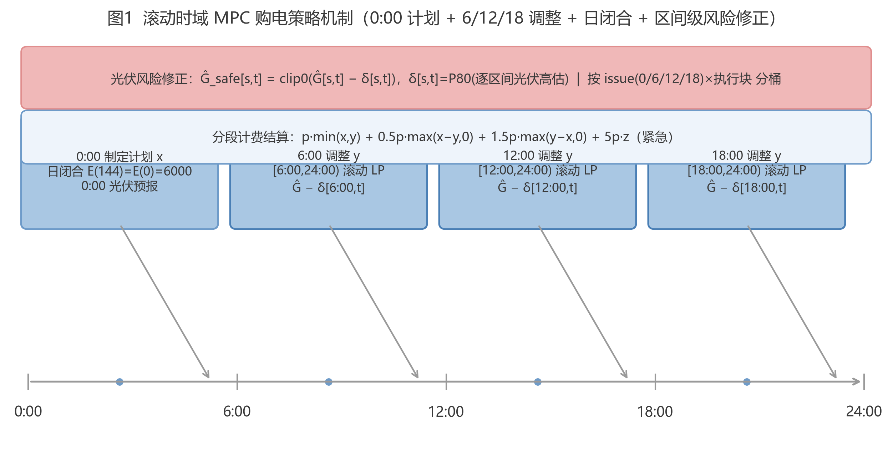
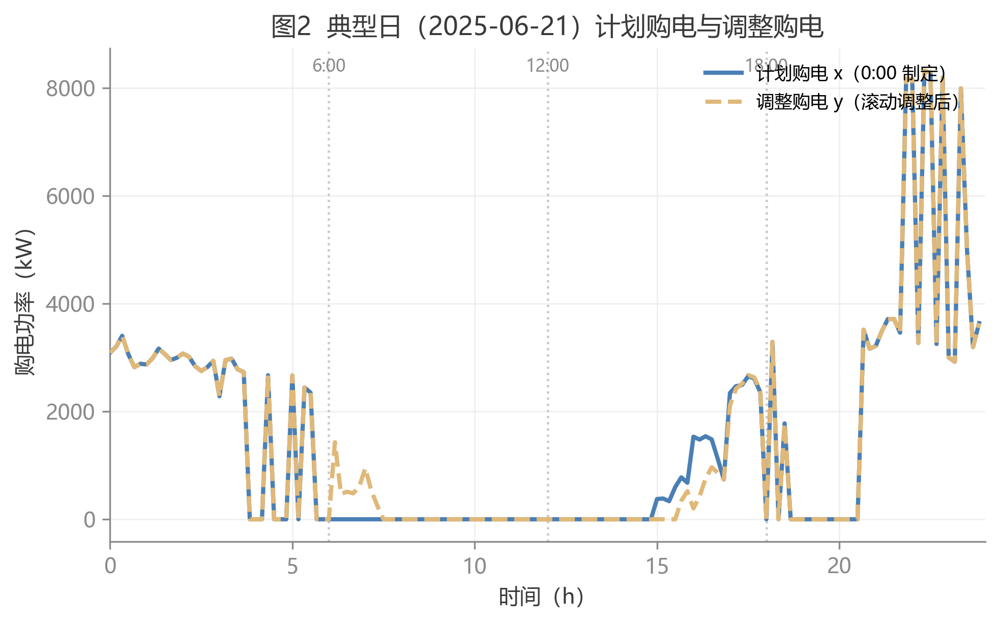
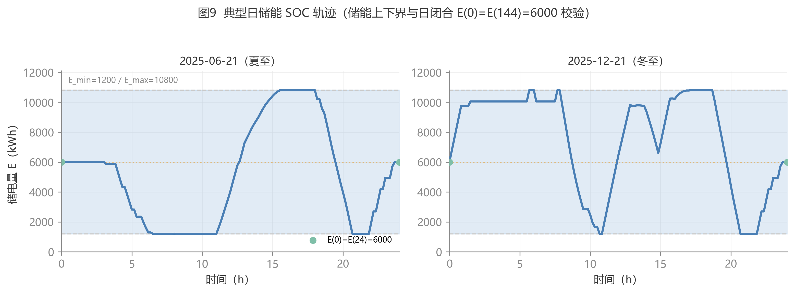
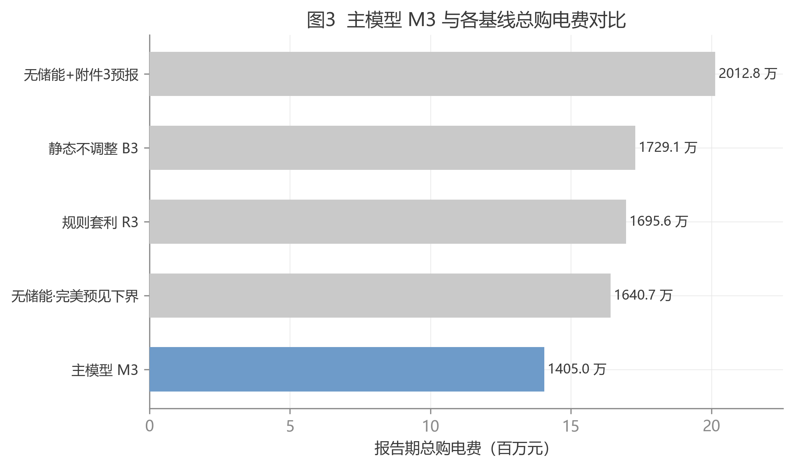
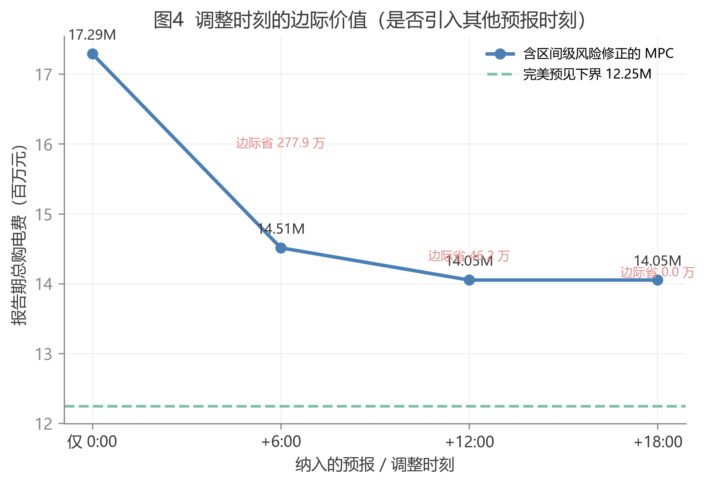
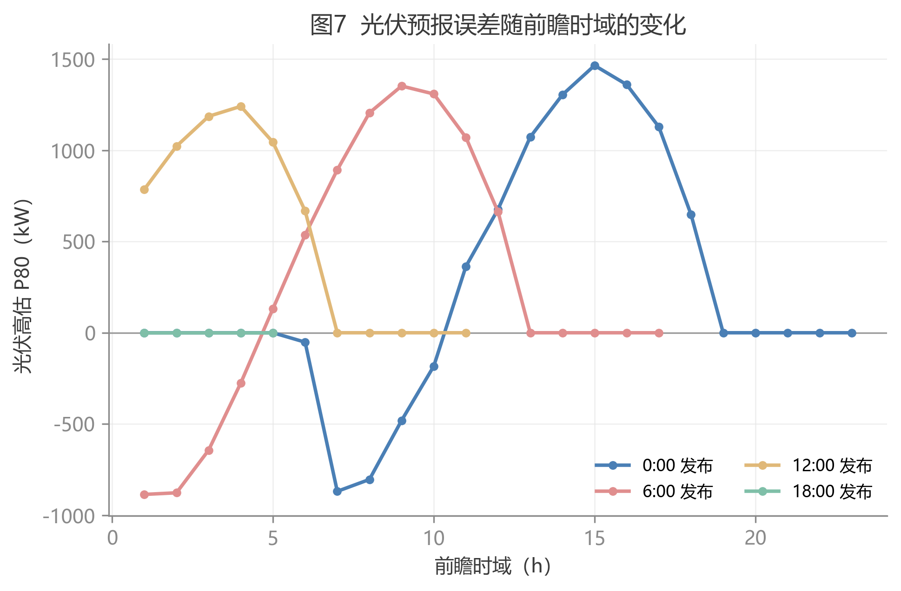
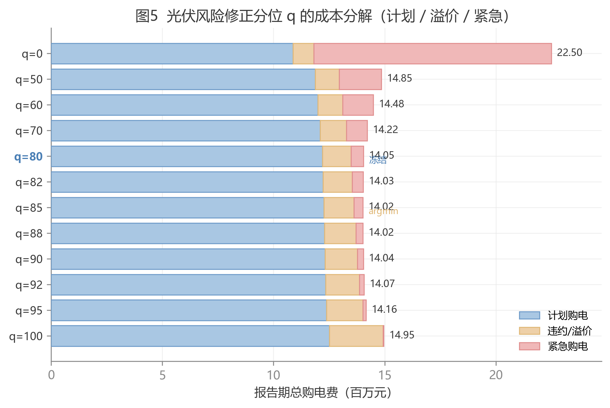
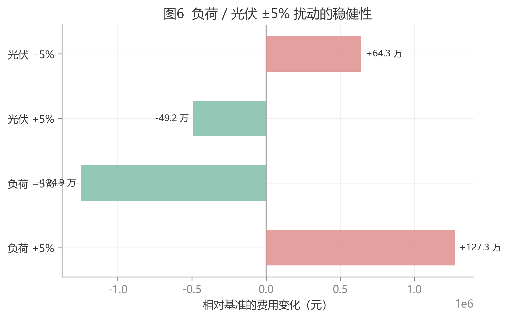

# 问题三：滚动预报下的计划—调整购电策略的建模与求解

> 本文为第三问论文初稿（G5），数值全部引自冻结文件 `results/Q3/reports/frozen_numbers.json`（round4 块级）与 round4 稳健性报告，公式严格复用 `planning/symbol_table.md` 符号表。材料索引见 `results/Q3/q3_material_support_form.md`。

## 一、问题重述与分析

### 1.1 问题重述

问题三在问题二的基础上引入**滚动光伏预报**：微网在每天 **0:00、6:00、12:00、18:00** 四个时刻均可获得未来 24 小时整点的光伏发电功率预报（附件 3）。微网在 0:00 依据当日 0:00 预报制定**计划购电策略**，在 6:00 / 12:00 / 18:00 依据各自最新预报**调整购电策略**。计费规则如下：

- 计划购电量高于调整购电量的部分，按交易时刻电价的 $\beta_{pen}=50\%$ 计**违约费**；
- 调整购电量高于计划购电量的部分，超出部分按交易时刻电价的 $\gamma_{pre}=1.5$ 倍计**溢价**；
- 供电不足部分仍须紧急购电，紧急电价为交易时刻电价的 $\alpha_{em}=5$ 倍。

总购电费由**计划购电费、紧急购电费与调整购电量相关费用**三部分构成。要求建立微网当天购电策略的数学模型，按表 1 / 表 2 / 表 3 给出指定日期结果、将完整策略保存到 `result3.xlsx`，并**分析是否需要引入其他时刻的预报**制定调整策略。

### 1.2 问题分析

本题的核心是**信息逐时更新下的滚动决策**：0:00 计划基于当日最早、最粗糙的预报；6:00 / 12:00 / 18:00 的调整则能利用更接近真实出力的预报修正剩余时段的购电计划，但调整并非免费——计划与调整的差量须按 $\beta_{pen}$ 或 $\gamma_{pre}$ 计费。因此模型须在"调整带来的预报改善收益"与"调整计费代价"之间权衡，本质是一个多阶段、信息非对称的随机决策问题。

进一步观察附件 3 的预报误差结构可发现，光伏预报存在**随发布时刻与执行时段双重差异化的系统性偏差**：6:00 发布的预报对上午时段系统性高估，若直接沿用会导致上午计划购电偏低、实际缺口被 5 倍紧急购电放大；12:00 发布的预报对午后时段则略偏保守。据此，本文建立"**区间级光伏风险修正 + 分段计费线性化 + 滚动时域 MPC**"的框架：先把预报的系统性高估修正为"保守预报"（把"高估→缺电→紧急 5 倍"转化为"保守→弃光→无惩罚"），再在 0:00 与 6/12/18 各时刻做滚动线性规划。

## 二、符号说明

本文符号严格沿用统一符号表（`planning/symbol_table.md`），关键符号如下，其余见符号表。

| 符号 | 含义 | 单位 |
|---|---|---|
| $d,t$ | 日期序号（第 $d$ 天）、日内区间序号（$t=1,\dots,T$，$T=144$，$\Delta t=1/6$ h） | — |
| $s$ | 预报发布时刻，$s\in\{0,6,12,18\}$（时） | — |
| $p_t$ | 恒定日电价（每天相同，附件 1） | 元/kWh |
| $L_{d,t},\, G_{d,t}$ | 第 $d$ 天区间 $t$ 实际负载、光伏实际功率（附件 2） | kW |
| $\hat G_{d,s,h}$ | 附件 3 光伏预报（$s$ 时刻发布、提前 $h$ 小时） | kW |
| $\hat G_{d,s,t}$ | 区间级光伏预报（整点预报 $\hat G_{d,s,h}$ 阶梯映射到 10 min 区间） | kW |
| $\hat G^{\mathrm{safe}}_{d,s,t}$ | 风险修正后安全光伏预报，$\hat G^{\mathrm{safe}}_{d,s,t}=\operatorname{clip}_0(\hat G_{d,s,t}-\delta_{d,s,t})$ | kW |
| $\delta_{d,s,t}$ | 区间级光伏风险修正量，$\delta_{d,s,t}=P_{80}(\hat G_{d,s,t}-G_{d,t})$ | kW |
| $x_{d,t},\, y_{d,t},\, z_{d,t}$ | 计划购电量、调整购电量、紧急购电量 | kWh |
| $c_{d,t},\, q_{d,t}$ | 充电电量、放电电量 | kWh |
| $E_{d,t}$ | 区间 $t$ 末储电量 | kWh |
| $E_{\min},\, E_{\max},\, E_0$ | 储电量下/上限 $=1200/10800$、初始储电量 $=6000$ | kWh |
| $P^{c}_{\max}=P^{d}_{\max}$ | 最大充/放电功率 $=5000$ | kW |
| $\eta_c,\,\eta_d$ | 充/放电效率 $=0.9$ | — |
| $\alpha_{em},\,\beta_{pen},\,\gamma_{pre}$ | 紧急/违约/溢价系数 $=5\,/\,0.5\,/\,1.5$ | — |
| $C_3$ | Q3 报告期总购电费 | 元 |

## 三、模型建立

### 3.1 滚动时域购电机制

每日调度按"一次计划 + 三次调整"执行：0:00 用当日 0:00 预报制定全天计划 $x_{d,t}$；6:00 / 12:00 / 18:00 分别用各自最新预报对剩余时段重解，得到调整购电 $y_{d,t}$；各段储能方案与上一段末态连续衔接；每日末储能回归 $E_0=6000$ kWh（日闭合），保证跨日可重复运行。机制如图 1 所示。

### 3.2 分段计费与线性化

同一 10 分钟区间内，以最终执行的调整购电 $y_{d,t}$ 与 0:00 计划 $x_{d,t}$ 比较计费。报告期总购电费 $C_3$ 为

$$
C_3 = \sum_{d,t} p_t\Big[\min(x_{d,t},y_{d,t}) + \beta_{pen}\max(x_{d,t}-y_{d,t},0) + \gamma_{pre}\max(y_{d,t}-x_{d,t},0)\Big] + \sum_{d,t}\alpha_{em}\,p_t\,z_{d,t},
$$

其中 $\beta_{pen}=0.5$、$\gamma_{pre}=1.5$、$\alpha_{em}=5$。该分段结构在 LP 中不可直接求解，故线性化：令 $y_{d,t}=u_{d,t}+v_{d,t}$，$0\le u_{d,t}\le x_{d,t}$（计划内购电，按 1 倍价）、$v_{d,t}\ge 0$（超出计划部分，按 $\gamma_{pre}$ 倍价）。因目标中系数 $0.5p_t < \gamma_{pre}p_t$，最优解自动取 $u^*=\min(y,x)$、$v^*=\max(y-x,0)$，等价还原分段结构；违约项 $\beta_{pen}\max(x-y,0)$ 在 $x$ 已知时是 $y$ 的线性项。由此整日调度保持为线性规划（LP），可由单纯形/内点法高效求解。

### 3.3 光伏预报风险修正（区间级分桶）

光伏预报存在**随发布时刻 $s$ 与执行时段 $t$ 双重差异化的系统偏差**。为消除偏差，对第 $d$ 天 $s$ 时刻发布的预报，按"**发布时刻 × 执行 6 h 块**"逐 10 min 区间构造 $q=80$ 分位的保守修正：

$$
\delta_{d,s,t} = P_{80}\!\big(\hat G_{d,s,t} - G_{d,t}\big),\qquad
\hat G^{\mathrm{safe}}_{d,s,t} = \operatorname{clip}_0\!\big(\hat G_{d,s,t} - \delta_{d,s,t}\big),
$$

其中 $\delta_{d,s,t}$ 仅在 $s$ 实际执行的 6 h 块 $t\in[6s,\,6s+6)$ 上逐区间取值（形状 $4\times 36$），且**因果滚动**估计（`min_hist=7` 天，只用第 $d$ 天之前的历史，无前视泄漏）。分位 $q=80$ 沿用报童临界比 0.8 的理论锚定（与问题二一致，$\alpha_{em}=5\Rightarrow q^\star=4/5=0.8$），样本内经验 argmin $q=85$ 与之仅差 0.21%（见 §5.1）。

**为何逐区间而非逐发布时刻标量**：按发布时刻分桶可解释预报误差方差的 43.5%，进一步按"发布时刻 × 执行块"分桶可再解释剩余方差。相较逐发布时刻标量修正（round3），块级修正使总费用由 15,081,833.10 元降至 14,049,999.28 元（**−6.84%**，见冻结 `sensitivity.granularity_improvement`）。修正量 $\delta_{d,s,t}$ 的 4×36 结构如图 2 所示：6:00 发布的预报对上午执行块修正量显著为正（高估），12:00 对午后块修正量较小、部分为负（略低估），18:00 后夜间光伏近零、修正量趋于 0。

### 3.4 逐日滚动 MPC 与日闭合

每日执行四段 LP，各段均以**安全预报** $\hat G^{\mathrm{safe}}_{d,s,t}$ 作为光伏输入、以区间 $t$ 末储电量 $E_{d,t}$ 为状态变量：

1. **0:00 计划**：用 $\hat G^{\mathrm{safe}}_{d,0,t}$ 解单日 LP，得计划 $x$、充放电 $c_0,q_0$ 与储电轨迹 $E_0(\cdot)$；
2. **6:00 调整**：用 $\hat G^{\mathrm{safe}}_{d,6,t}$ 对 $[36,144)$ 重解调整 LP（初值 $E_0[36]$），得 $y_1,c_1,q_1$；
3. **12:00 调整**：对 $[72,144)$（初值 $E_1[36]$），得 $y_2,c_2,q_2$；
4. **18:00 调整**：对 $[108,144)$（初值 $E_2[36]$），得 $y_3,c_3,q_3$；
5. **拼接执行**：$y=[x_{[:36]},\,y_1,\,y_2,\,y_3]$，储能方案同法拼接，各段首态与上段末态连续。

本文假设微网在计划/调整时刻已知当日电价 $p_t$ 与负载 $L_{d,t}$（附件 1、附件 2），光伏出力 $G_{d,t}$ 为唯一不确定量：依据附件 3 预报并经风险修正后得到 $\hat G^{\mathrm{safe}}_{d,s,t}$ 代入 LP，实际光伏仅用于结算与紧急购电。每段 LP 的约束为（以 0:00 计划为例，调整段同构，将 $x$ 换成 $y$）：

- **能量平衡**（用安全预报作为光伏输入，供电 ≥ 需求）：

$$
x_t + \hat G^{\mathrm{safe}}_{d,0,t}\,\Delta t + q_t \;\ge\; L_{d,t}\,\Delta t + c_t.
$$

- **储能动态与边界**：

$$
E_{t+1}=E_t+\eta_c\,c_t-\frac{q_t}{\eta_d},\qquad
E_{\min}\le E_t\le E_{\max},\qquad
0\le c_t\le P^{c}_{\max}\Delta t,\quad 0\le q_t\le P^{d}_{\max}\Delta t.
$$

- **日闭合约束**：$E_T=E_0$（即 $E(144)=E(0)=6000$），保证每日独立可重复、储能跨日连续且不末端短视，保留"夜充晨放"的跨时段套利能力。

其中 $\Delta t=1/6$ h，$E_{\min}=1200$，$E_{\max}=10800$，$P^{c}_{\max}=P^{d}_{\max}=5000$ kW，$\eta_c=\eta_d=0.9$。

### 3.5 实际结算与紧急购电

调度执行后以**真实光伏** $G_{d,t}$ 结算：供电不足部分由紧急购电 $z_{d,t}$（5 倍价）补齐，

$$
z_{d,t} = \max\big(L_{d,t}\Delta t + c_{d,t} - y_{d,t} - G_{d,t}\Delta t - q_{d,t},\ 0\big).
$$

由此满足统一能量平衡 $y_{d,t}+z_{d,t}+G_{d,t}\Delta t+q_{d,t} \ge L_{d,t}\Delta t+c_{d,t}$（与符号表核心关系式一致）。当日实际费用按 §3.2 的分段计费加 5 倍紧急计费，全年累加得 $C_3$。

## 四、模型求解与结果

### 4.1 求解流程

对每天 $d$ 依序执行四段 LP（1 个全天计划 + 3 个剩余时段调整），全年报告期 334 天共 **1336 次线性规划**。每段 LP 的变量为 $\{u,v,c,q,E\}$，约束为能量平衡、$u\le x$、充放电上限、储能边界与递推、日闭合，单段求解 < 0.1 s。调用 scipy `linprog`（HiGHS 求解器），种子 `SEED=2026`。基线方案与主模型**同信息集、同计费、同日闭合、同块级修正口径**，保证可比。

### 4.2 主模型结果

主模型 M3（滚动 MPC + 分段计费 + 日闭合 + 区间级 80 分位修正）的报告期总购电费及成本构成如表 4。

**表 4　主模型 M3 的成本构成**

| 指标 | 数值 |
|---|---|
| 报告期总购电费 $C_3$ | **14,049,999.28 元** |
| 其中：计划购电费 | 12,208,135.40 元 |
| 其中：违约/溢价费 | 1,277,803.18 元 |
| 其中：紧急购电费 | 564,060.69 元 |
| 紧急购电电量 | 145,059.00 kWh |
| 弃光电量 / 弃光率 | 1,914,415.30 kWh / 10.04% |
| 储电量校验 | $E\in[1200,10800]$ kWh 恒成立；$E(0)=E(144)=6000$ kWh（日闭合成立） |

三项费用合计 12,208,135.40 + 1,277,803.18 + 564,060.69 = 14,049,999.28 元（末位 0.01 元为四舍五入），与目标值一致。紧急购电费仅占总费用 4.01%（564,060.69 / 14,049,999.28），说明区间级 80 分位风险修正已把"少购被罚"的尾部风险控制在较低水平：光伏预报高估导致的缺口绝大部分被"保守预报→计划多购/储能调节"吸收，而非由 5 倍紧急购电承担。

### 4.3 指定日期结果（表 1 / 表 2 / 表 3）

按题目要求，取四个指定日期（2025.3.20 春分、2025.6.21 夏至、2025.9.23 秋分、2025.12.21 冬至）给出购电与储能结果。表 1(a)、表 1(b) 给出指定时间段的计划与调整购电量，表 2 给出储能充放电量，表 3 给出紧急购电量（完整 144 区间策略见 `result3.xlsx`）。

**表 1(a)　计划购电量（0:00 制定，单位 kWh）**

| 时间段 | 2025.3.20 | 2025.6.21 | 2025.9.23 | 2025.12.21 |
|---|---|---|---|---|
| 10:00–10:10 | 0.00 | 0.00 | 0.00 | 0.00 |
| 12:00–12:10 | 553.56 | 0.00 | 358.67 | 954.54 |
| 14:00–14:10 | 0.00 | 0.00 | 0.00 | 0.00 |
| 16:00–16:10 | 641.13 | 112.92 | 550.19 | 789.89 |
| 18:00–18:10 | 682.35 | 392.37 | 752.64 | 712.63 |
| 20:00–20:10 | 0.00 | 0.00 | 0.00 | 0.00 |
| **全天计划购电量** | **67,445.61** | **34,408.34** | **68,149.94** | **93,776.07** |

**表 1(b)　调整购电量（6/12/18 滚动调整后执行，单位 kWh）与全天购电费**

| 时间段 | 2025.3.20 | 2025.6.21 | 2025.9.23 | 2025.12.21 |
|---|---|---|---|---|
| 10:00–10:10 | 0.00 | 0.00 | 0.00 | 0.00 |
| 12:00–12:10 | 518.34 | 0.00 | 404.40 | 876.09 |
| 14:00–14:10 | 0.00 | 0.00 | 0.00 | 0.00 |
| 16:00–16:10 | 641.13 | 86.51 | 503.21 | 789.89 |
| 18:00–18:10 | 682.35 | 398.65 | 752.64 | 712.63 |
| 20:00–20:10 | 0.00 | 0.00 | 0.00 | 0.00 |
| **全天调整购电量** | **66,019.49** | **34,209.59** | **69,157.25** | **95,628.10** |
| **全天购电费（元）** | **47,687.44** | **21,128.55** | **46,350.11** | **64,619.65** |

对比表 1(a) 与表 1(b) 可见，调整购电与计划购电在 12:00、16:00、18:00 等时段发生分歧（如 6.21 的 12:00–12:10 计划为 0、调整为 0 不变，而 16:00–16:10 由 112.92 调至 86.51），体现了滚动调整利用新预报修正光伏高估偏差的作用。

**表 2　储能设备充放电量（单位 kWh）及 0:00 / 24:00 储电量**

| 时间段 | 3.20 充电 | 3.20 放电 | 6.21 充电 | 6.21 放电 | 9.23 充电 | 9.23 放电 | 12.21 充电 | 12.21 放电 |
|---|---|---|---|---|---|---|---|---|
| 0:00–4:00 | 4500.00 | 0.00 | 0.00 | 583.54 | 4500.00 | 0.00 | 4500.00 | 0.00 |
| 4:00–8:00 | 833.33 | 6074.65 | 11.92 | 3736.46 | 833.33 | 6182.83 | 1666.67 | 1508.33 |
| 8:00–12:00 | 2825.20 | 2565.35 | 3166.05 | 9.65 | 5579.99 | 2457.17 | 5833.33 | 7806.67 |
| 12:00–16:00 | 8108.85 | 421.94 | 7500.62 | 0.00 | 6129.59 | 844.76 | 7854.23 | 2973.67 |
| 16:00–20:00 | 253.54 | 5709.78 | 1.75 | 6155.52 | 0.00 | 5602.91 | 650.30 | 5797.47 |
| 20:00–24:00 | 5333.33 | 2930.22 | 5333.33 | 2485.90 | 5333.33 | 3037.09 | 5333.33 | 2842.53 |

> 0:00 与 24:00 储电量：四个指定日期均为 **6000.00 kWh**（滚动 MPC 日闭合约束 $E(0)=E(144)=6000$）。

**表 3　紧急购电量（单位 kWh，仅列发生紧急购电的区间）**

| 2025.3.20 时段 | 购电量 | 2025.6.21 时段 | 购电量 | 2025.9.23 时段 | 购电量 | 2025.12.21 时段 | 购电量 |
|---|---|---|---|---|---|---|---|
| 6:10–6:20 | 79.27 | 4:10–4:20 | 1.12 | 7:10–7:20 | 28.85 | 10:00–10:10 | 10.46 |
| 6:20–6:30 | 47.52 | 4:20–4:30 | 1.16 | 7:20–7:30 | 25.90 | 11:10–11:20 | 135.22 |
| 6:30–6:40 | 35.07 | 4:30–4:40 | 1.16 | 7:30–7:40 | 40.17 | 11:20–11:30 | 134.32 |
| 6:40–6:50 | 32.83 | 4:40–4:50 | 0.64 | 7:40–7:50 | 24.45 | 11:30–11:40 | 107.06 |
| 6:50–7:00 | 21.55 | 4:50–5:00 | 1.16 | 7:50–8:00 | 6.34 | 11:40–11:50 | 105.23 |
| 7:00–7:10 | 5.15 | 6:10–6:20 | 15.16 | 8:10–8:20 | 7.73 | 11:50–12:00 | 74.86 |
| 7:50–8:00 | 3.78 | 6:20–6:30 | 8.55 | 8:20–8:30 | 3.28 | 12:00–12:10 | 30.59 |
| 8:00–8:10 | 9.26 | 6:30–6:40 | 3.64 | 8:30–8:40 | 11.31 | 16:10–16:20 | 17.32 |
| 8:10–8:20 | 12.03 | 6:40–6:50 | 12.22 | 8:40–8:50 | 11.15 | 16:20–16:30 | 8.46 |
| 8:20–8:30 | 22.15 | 6:50–7:00 | 6.20 | 8:50–9:00 | 1.68 | 16:30–16:40 | 12.05 |
| 8:30–8:40 | 38.26 | 7:00–7:10 | 0.52 | 11:10–11:20 | 52.13 | 16:40–16:50 | 10.71 |
| 8:40–8:50 | 14.51 | 14:10–14:20 | 17.95 | 18:10–18:20 | 0.01 | 16:50–17:00 | 6.38 |
| 8:50–9:00 | 1.40 | 14:20–14:30 | 14.25 | — | — | 17:10–17:20 | 21.07 |
| 9:00–9:10 | 34.40 | 14:30–14:40 | 1.89 | — | — | 17:20–17:30 | 0.08 |
| 9:10–9:20 | 43.52 | 16:10–16:20 | 44.97 | — | — | 17:40–17:50 | 0.11 |
| 9:20–9:30 | 13.41 | 16:20–16:30 | 32.54 | — | — | — | — |
| 9:50–10:00 | 35.71 | — | — | — | — | — | — |
| 10:00–10:10 | 29.95 | — | — | — | — | — | — |
| 10:10–10:20 | 18.91 | — | — | — | — | — | — |
| 10:20–10:30 | 24.31 | — | — | — | — | — | — |
| 10:30–10:40 | 32.21 | — | — | — | — | — | — |
| 11:00–11:10 | 46.16 | — | — | — | — | — | — |
| 11:10–11:20 | 118.29 | — | — | — | — | — | — |
| 11:20–11:30 | 133.98 | — | — | — | — | — | — |
| 11:30–11:40 | 104.15 | — | — | — | — | — | — |
| 11:40–11:50 | 84.27 | — | — | — | — | — | — |
| 11:50–12:00 | 64.19 | — | — | — | — | — | — |
| 12:00–12:10 | 39.97 | — | — | — | — | — | — |
| 12:40–12:50 | 63.15 | — | — | — | — | — | — |
| 12:50–13:00 | 62.08 | — | — | — | — | — | — |
| 13:00–13:10 | 2.22 | — | — | — | — | — | — |
| 13:10–13:20 | 6.23 | — | — | — | — | — | — |
| 13:20–13:30 | 74.83 | — | — | — | — | — | — |
| 13:30–13:40 | 91.22 | — | — | — | — | — | — |
| 13:40–13:50 | 76.53 | — | — | — | — | — | — |
| 13:50–14:00 | 26.79 | — | — | — | — | — | — |
| 15:00–15:10 | 3.10 | — | — | — | — | — | — |
| 16:00–16:10 | 2.47 | — | — | — | — | — | — |

> 汇总：四个指定日期的紧急购电区间数分别为 **38 / 16 / 12 / 15** 个，紧急购电总量分别为 **1554.81 / 163.11 / 213.00 / 673.92 kWh**。经区间级 80 分位风险修正后，6:00 高估造成的上午缺口多数转为弃光，紧急购电集中于光伏预测高估最显著的上午与午后时段。

### 4.4 典型日策略与储能轨迹验证

以夏至日（2025-06-21）为例，图 3 给出计划购电与调整购电的日内时序：两条曲线在 6:00、12:00、18:00 三个调整点之后出现分歧，调整购电在前一时段计划偏低处上调、计划偏高处下调，体现了滚动调整对新预报信息的即时利用。

图 4 给出夏至、冬至两日的储能 SOC 轨迹，用于验证储能约束满足性：全年全区间 $E\in[1200,10800]$ kWh、充放功率不超过 5000 kW，且每日 $E(0)=E(144)=6000$ kWh 日闭合成立，储能"夜间充电、昼间放电"的套利与支撑行为清晰可见。

### 4.5 与基线的对比

在相同信息集与计费口径下构造四个对照方案，报告期总购电费如表 5、图 5。

**表 5　主模型与各基线的总购电费对比**

| 方案 | 说明 | 总购电费（元） |
|---|---|---|
| **M3 主模型** | 滚动 MPC + 区间级修正 + 储能 | **14,049,999.28** |
| B3 静态不调整 | 仅 0:00 计划并执行 | 17,291,136.58 |
| R3 规则套利 | 滚动预报贪心规则 | 16,956,099.35 |
| B3_ref 无储能·完美预见 | 无储能但已知实际光伏（诊断参照） | 16,407,319.63 |
| NS_fc 无储能·附件3预报 | 无储能 + 0:00 预报（无修正） | 20,128,453.40 |

由表 5 可得四项经济价值（均为冻结绝对值相减）：

- **调整价值** $= B_3 - C_3 = 17{,}291{,}136.58 - 14{,}049{,}999.28 = 3{,}241{,}137.30$ 元，即滚动调整相对"仅 0:00 计划"的降费；
- **优化价值** $= R_3 - C_3 = 16{,}956{,}099.35 - 14{,}049{,}999.28 = 2{,}906{,}100.07$ 元，即优化调度相对经验贪心规则的增益；
- **储能价值（相对无储能+预报）** $= NS_{fc} - C_3 = 20{,}128{,}453.40 - 14{,}049{,}999.28 = 6{,}078{,}454.12$ 元，含储能、滚动调整与风险修正的协同降费；
- **修正价值** $= C_3^{\text{无修正}} - C_3 = 16{,}970{,}240.79 - 14{,}049{,}999.28 = 2{,}920{,}241.51$ 元，即区间级风险修正相对无修正方案的降费（`sensitivity.scheme_A_no_correction.total_cost`）。

值得说明：主模型总费用（14,049,999.28 元）**低于**"无储能·完美预见"诊断参照（16,407,319.63 元）2,357,320.35 元。这里的"无储能·完美预见"是**无储能方案族**的参照值（已知实际光伏、仅无储能），并非主模型的全局下界；该对比的含义是：储能 + 滚动调整 + 风险修正的协同价值（6,078,454.12 元，相对无储能但用预报的方案）**足以覆盖光伏预报误差的代价**（3,721,133.77 元 $= NS_{fc} - B_3^{ref}$），因此即便使用有偏的预报，含储能的主模型仍优于"无储能但完美预见"的情形。

### 4.6 是否需要引入其他预报时刻

**结论：不需要。** 依据有二：

其一，**调整时刻的边际价值递减**（表 6、图 6）。从"仅 0:00 计划"出发，依次纳入 6:00、12:00、18:00 调整，边际节省依次为 2,779,386.78 元、461,749.24 元、1.28 元——第 4 个调整时刻（18:00）的边际贡献仅 1.28 元，几乎为零。

**表 6　调整时刻边际价值（阶段消融）**

| 纳入的调整时刻 | 总费用（元） | 边际节省（元） | 边际节省占前一阶段费用 |
|---|---|---|---|
| 仅 0:00（=B3） | 17,291,136.58 | — | — |
| + 6:00 | 14,511,749.80 | 2,779,386.78 | 16.07% |
| + 12:00 | 14,050,000.56 | 461,749.24 | 3.18% |
| + 18:00（=M3） | 14,049,999.28 | 1.28 | ≈0% |
| 完美预见上界（4 时刻用实际光伏） | 12,245,046.92 | — | — |

其二，**18:00 后夜间光伏近零，无可修正信息**。图 7 显示各发布时刻的预报误差（P80 高估）随前瞻时域的变化：0:00 发布的预报误差在午后（约 +17 h）达到峰值后夜间归零，18:00 发布的预报其执行块（18:00–24:00）误差已基本为零。换言之，18:00 之后没有可被修正的光伏信息，加密预报时刻只会用同样有偏的预报细化窗口，无法消除 6:00 对上午的系统性高估。

综上，主模型与完美预见上界的差距（14,049,999.28 − 12,245,046.92 = 1,804,952.36 元）**主因预报精度**（尤其 6:00 对上午的系统性高估），而非预报频次；在保持 0/6/12/18 四时刻的前提下，进一步提高精度的收益大于增加预报时刻。

## 五、稳健性与敏感性分析

### 5.1 风险分位敏感性

对风险修正分位 $q$ 做全扫描，并按计划 / 溢价 / 紧急三项分解成本（图 8）。总费用在 $q=85$ 处取最小值 14,020,104.48 元，$q=80$ 为 14,049,999.28 元、仅高 0.21%（目标在 $[80,95]$ 平坦）。$q$ 越大，紧急购电费单调下降（从 $q=0$ 的 10,691,249.63 元降至 $q=100$ 的 23,924.17 元）、违约/溢价费单调上升，二者此消彼长使总费用在 80–95 分位间平坦。$q=0$（修正量取历史高估最小值、实为反向抬高预报）时总费用高达 22,498,657.05 元，甚至高于无修正方案的 16,970,240.79 元，验证了风险修正的**方向**与**适度性**都不可忽略。据此取 $q=80$ 作冻结主值（报童临界比 0.8 理论锚定），$q=85$ 仅作稳健性对照。

### 5.2 负荷 / 光伏扰动

对负荷与光伏分别施加 ±5% 扰动，结果如表 7、图 9：负荷 +5% / −5% 使总费用变化 +9.1% / −8.9%，光伏 +5% / −5% 使总费用变化 −3.5% / +4.6%。变化近似线性、无断崖、无放大振荡，说明模型对输入扰动稳健。

**表 7　负荷 / 光伏 ±5% 扰动的稳健性**

| 扰动 | 总费用（元） | 相对基准 |
|---|---|---|
| 基准 | 14,049,999.28 | — |
| 负荷 +5% | 15,323,269.85 | +9.1% |
| 负荷 −5% | 12,800,522.15 | −8.9% |
| 光伏 +5% | 13,558,109.22 | −3.5% |
| 光伏 −5% | 14,692,631.48 | +4.6% |

### 5.3 扩展对照：两阶段随机规划

为检验"固定分位余量"这一不确定处理方式是否稳健，构造一个信息集完全一致的两阶段随机规划（SP）作**扩展对照**：阶段 0（here-and-now）在 0:00 制定计划 $x$，决策在场景间共享（非预见性）；阶段 1 用 6/12/18 各 issue 预报做确定性 recourse；紧急购电 $z$ 用场景实际光伏结算。场景由历史（$<d$）0:00 预报误差的**块 bootstrap** 生成（因果、无前瞻）。结果如表 8。

**表 8　两阶段随机规划扩展对照（元）**

| 量 | 值 | 含义 |
|---|---|---|
| SP 出样本实际结算 | 13,791,763.20 | 真实光伏滚动结算 |
| SP 样本内期望 RP | 13,833,708.88 | here-and-now 期望费用 |
| WS（完美预见，含储能） | 12,245,046.92 | 完美信息上界 |
| EVPI（$=RP-WS$） | 1,588,661.96 | 完美信息价值 |
| 相较确定性基线策略的收益 | 258,236.08 | 块级基线 − SP 出样本（=25.82 万元，−1.84%） |

SP 出样本较主模型（块级顺序法 14,049,999.28 元）低 25.82 万元（−1.84%），且在场景数 $N=20/30/50/80$ 下稳健；出样本与样本内接近，无明显过拟合。**术语口径**：本文不使用 VSS——教科书 VSS = EEV − RP 需先按标准定义重算 EEV，而此处 25.82 万元是"滚动确定性基线 vs SP"的差值，语义不同，故如实命名为"相较确定性基线策略的收益"。需说明，SP 的 6/12/18 recourse 为均值（确定性）recourse，未按场景实现的光伏逐阶段反应，属可选增强。鉴于 SP 增益有限（1.84%）且主模型已足够优，**问题三主模型仍取块级顺序法**，SP 仅作扩展对照。

## 六、模型评价

### 6.1 优点

1. **信息集严格合规**：0:00 计划仅用 0:00 预报，6/12/18 调整仅用各自发布时刻的预报；风险修正只用 $d$ 之前历史（因果滚动，无前视泄漏）。
2. **风险修正有理论支撑**：80 分位沿用报童临界比 0.8 解析锚定；实测经验 argmin $q=85$ 与 $q=80$ 仅差 0.21%，验证取值稳健、非经验调参。
3. **分段计费精确线性化**：通过 $y=u+v$、$0\le u\le x$ 将 min/max 分段费用精确还原为 LP，求解高效（全年 1336 次 LP、单段 <0.1 s），可解释、可复现。
4. **结论可溯源**：全部绝对结果数值引自冻结文件，派生价值由冻结绝对值相减并在正文写明算式。

### 6.2 局限

1. 风险修正按"发布时刻 × 执行块"分桶后未进一步对季节/天气分层，极端连续阴雨可能仍触发较多紧急购电。
2. 光伏预报沿用整点预报的阶梯映射（区间内恒定），未对 10 min 内的次小时波动建模。
3. 两阶段随机规划为均值 recourse 的简化扩展，未做真多阶段场景相关 recourse；鉴于其增益有限，主模型未采用。

## 七、参考文献

[1] 2026 年全国大学生数学建模竞赛 C 题《微网与外部电网电力调控策略》题目与附件 1–5.
[2] 姜启源, 谢金星, 叶俊. 数学模型（第四版）[M]. 北京: 高等教育出版社, 2011.
[3] Dantzig G B. Linear Programming and Extensions[M]. Princeton: Princeton University Press, 1963.
[4] Huangfu Q, Hall J A J. Parallelizing the dual revised simplex method[J]. Mathematical Programming Computation, 2018, 10(1): 119–142.
[5] Silver E A, Pyke D F, Peterson R. Inventory Management and Production Planning and Scheduling[M]. 3rd ed. New York: John Wiley & Sons, 1998.
